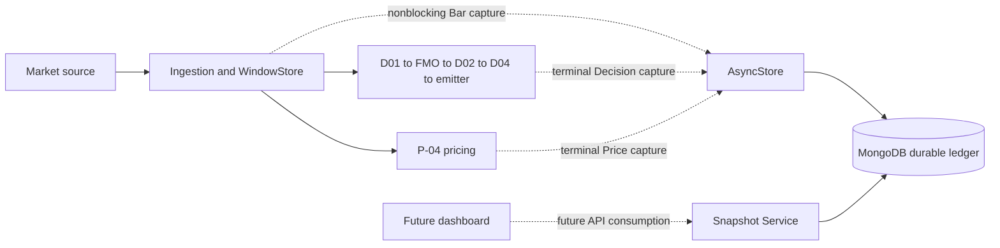
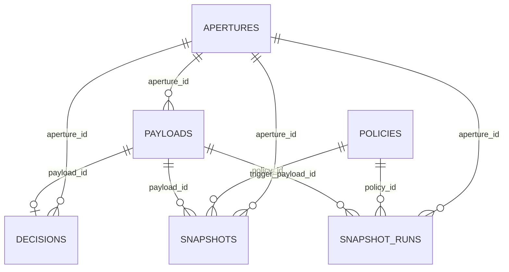
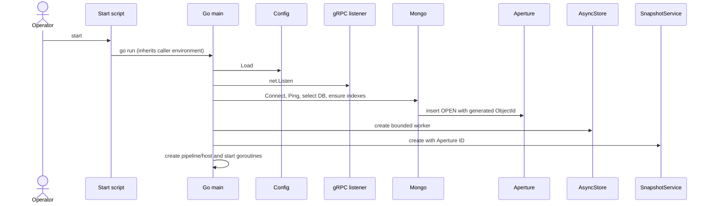
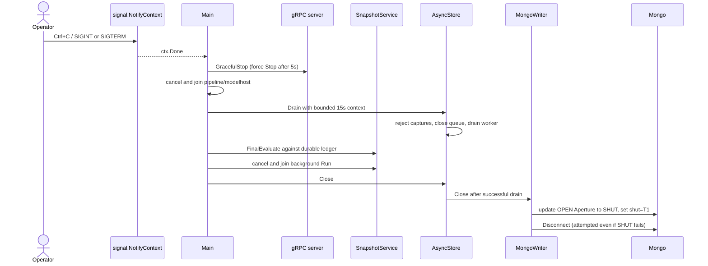
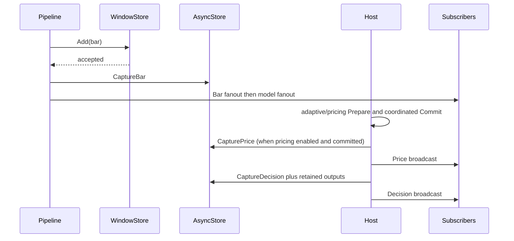

# QuanTRAM MongoDB Aperture Persistence V1

## 1. Document Control

| Item | Value |
|---|---|
| Specification type | Definitive design specification |
| Date | September 4, 2026 |
| Branch | `mongodb-persistene-v1` |
| Status | Coordinated lifecycle implemented and offline-validated; live Mongo E2E remains pending |
| Implementation authority | Current Go, proto, BSON mappings, indexes, configuration, and tests |
| Database | `quantram_db` by default |

This document supersedes the September 3 summary. Labels mean: **IMPLEMENTED**, **IMPLEMENTED / NOT LIVE-VALIDATED**, **DESIGN INTENT / NOT IMPLEMENTED**, **FUTURE**, or **GAP / HUMAN REVIEW REQUIRED**.

## 2. Executive Overview

An **Aperture** is the durable bounded record of one QuanTRAM Go-server runtime invocation in the V1/E2E architecture. When Mongo persistence is enabled, one viable server startup creates one Aperture; accepted Payloads, convergent Decisions records, Snapshots, and SnapshotRuns reference its Mongo ObjectId. Coordinated close stops gRPC work, joins runtime producers, drains accepted ledger writes, performs a final policy-exact Snapshot evaluation, joins Snapshot processing, marks that Aperture `SHUT`, and disconnects MongoDB. An abrupt exit or failed persistence drain leaves `OPEN` plus `shut: null`, which is retained as evidence of an incomplete run.

The design separates durable history from scientific computation. MongoDB is an asynchronous ledger and Snapshot provider, not D01, FMO, D02, D04, emitter, or P-04.

## 3. Scope

V1 covers six collections, server-owned Aperture identity, Payload/Decisions capture, asynchronous ledger writes, Snapshot references, and offline validation. It excludes dashboard implementation, historical reconstruction APIs for Payload/Decisions, order/execution/P&L persistence, orphan repair, retention, migrations, and live Mongo E2E validation.

## 4. Definitions and Vocabulary

| Term | Definition |
|---|---|
| Aperture | One persisted Go-server run boundary and lineage root. |
| Payload | V1 envelope containing one canonical accepted `domain.Bar`. The generic name reserves future payload kinds. |
| Decisions | One document per Payload, incrementally converging `decision_event`/adaptive outputs and `price_event`. |
| Snapshot | Small checkpoint reference to a Payload within an Aperture; not a copy of scientific state. |
| SnapshotRun | Audit record for one checkpoint persistence attempt. |
| Policy | Persisted rule that selects checkpoints; V1 supports `EVERY_N_BARS`. |
| CURRENT | Future dashboard mode for the running Aperture/latest durable position; not “the last 64 Bars.” |
| HISTORY | Future selection of a retained Aperture and checkpoint position. |

## 5. Aperture Domain Concept

Purpose: bind all durable facts from one process invocation to one identity, preserve start/end evidence, and provide a future historical navigation boundary. Mongo `_id` is persistence identity. `sequence_num` is a monotonically allocated human/display sequence; no `APT-xxxxx` formatting exists in code.

The approved invariant is **one Mongo-enabled server invocation = one newly created Aperture**. Code creates no Aperture when `QUANTRAM_MONGODB_URI` is absent. It never selects, repairs, deletes, or reattaches to a prior OPEN Aperture.

## 6. Architectural Principles

1. Go owns runtime and scientific truth; Mongo stores historical facts.
2. Aperture identity remains application/persistence context and never enters scientific mathematics.
3. Payloads are immutable insert-once envelopes per `(aperture_id, market_snapshot_id)`.
4. Decisions converge by `payload_id` because pricing and adaptive outcomes can arrive independently.
5. Capture is bounded and nonblocking; persistence failure cannot roll back science.
6. Snapshots reference durable ledger positions and do not duplicate science.
7. Old incomplete Apertures are operational evidence, not startup inputs.

## 7. System Context



## 8. Logical Aperture Hierarchy

This is a logical hierarchy; Mongo stores separate collections joined by references.

```text
QuanTRAM Historical Runtime
+-- Aperture A
|   +-- Payload 1
|   |   +-- Bar
|   +-- Decisions 1
|   |   +-- DecisionEvent
|   |   +-- adaptive_outputs: DMO, FMO, ReturnShape, Capturability
|   |   +-- PriceEvent
|   +-- Payload 2 / Decisions 2 / ...
|   +-- Snapshot checkpoints
|       +-- Snapshot 1 -> Payload 10
|       +-- Snapshot 2 -> Payload 20
|       +-- Snapshot 3 -> Payload 30
+-- Aperture B
+-- Aperture C
```

## 9. Physical Mongo Collection Relationships



No Mongo foreign-key mechanism enforces these references; application filters and indexes provide consistency.

## 10. Aperture State Machine

```mermaid
stateDiagram-v2
    [*] --> NotCreated: Mongo disabled or startup not viable
    NotCreated --> OPEN: listener bound; Mongo connected/pinged; indexes ready; insert succeeds
    OPEN --> SHUT: producers joined; queue drained; final Snapshot scan; SHUT update succeeds
    OPEN --> OPEN: abnormal/fatal termination leaves durable evidence
    OPEN --> OPEN: bounded queue drain fails; disconnect without SHUT
    SHUT --> [*]: Mongo disconnected
```



**Implemented contract:** stop gRPC intake; cancel and join pipeline/modelhost; seal and drain accepted persistence work; perform a final Snapshot evaluation against durable facts; cancel and join SnapshotService; then attempt SHUT and disconnect. A failed drain is not represented as SHUT: outstanding work is failure-accounted, the worker is canceled and joined, the Aperture remains OPEN, and Mongo disconnect is attempted.

## 11. Normal Lifecycle

Normal signal path: configuration validates; listener binds; Mongo connects and pings; all indexes are ensured; one Aperture is inserted as OPEN; runtime writes share its `_id`; SIGINT/SIGTERM or gRPC Serve completion enters `shutdownRuntime`; gRPC stops; pipeline/modelhost are canceled and joined; persistence drains; final Snapshot evaluation runs; SnapshotService is canceled and joined; writer attempts SHUT then disconnect. Post-Aperture setup and Serve errors return through `run`, so the fallback close path is retained instead of using `log.Fatalf` inside the lifecycle.

Normal terminal representation:

```javascript
{ open: T0, shut: T1, status: "SHUT" }
```

## 12. Abnormal Lifecycle

SIGKILL, process crash, power loss, or unrecovered runtime failure can bypass coordinated close:

```javascript
{ open: T0, shut: null, status: "OPEN" }
```

No startup code searches for old OPEN records. Run 2 creates B even when Run 1 left A OPEN.

## 13. Startup Semantics

Creation occurs after configuration load and listener bind, then after Mongo connect, ping, database selection, and index creation, but before `AsyncStore`, SnapshotService, pipeline, host, or serving goroutines start. This avoids records for configuration/listener/Mongo-index failures while ensuring runtime persistence has a parent. Recoverable failures later in composition return through `run` and its persistence fallback close.



## 14. Shutdown Semantics



If drain times out, AsyncStore cancels and joins its worker, counts the current failed item and queued abandoned items in failure health, skips final Snapshot and SHUT, and invokes Mongo-only disconnect. `shut` is the UTC time at which `MongoWriter.Close` attempts the durable transition after the coordinated phases; it is not signal-receipt time.

Ctrl+C and SIGTERM are **code-path proven when delivered to the server process**, but not live E2E validated. The PowerShell smoke-test path uses forceful `Stop-Process -Force`; it is not proof of orderly SHUT.

## 15. Identity and Sequence Model

Mongo generates `_id` on Aperture insert. `LatestSequence` sorts `sequence_num` descending, returns zero for an empty collection, and creation inserts `latest + 1`. A unique ascending index is authoritative. Duplicate-key races retry the read/insert cycle up to five total attempts. Sequence gaps are allowed; atomic counter semantics are not implemented.

## 16. Payload Contract

Envelope: `{_id ObjectId, aperture_id ObjectId, bar object}`. All Bar fields have BSON tags and are stored: `symbol`, `instrument_id`, `instrument_type`, `tradable`, `interval`, `interval_start_unix_ms` (BSON date), `interval_end_unix_ms` (date), `open`, `high`, `low`, `close` (double), `volume` (integer), `event_count` (integer), `source_timestamp` (string), `receipt_unix_ms` (date), `source`, `quality_status`, `is_final`, `is_backfilled`, `source_transition`, and `market_snapshot_id`.

`market_snapshot_id` is the correlation identity used with `aperture_id` for idempotent Payload upsert and later Payload lookup by Decision/Price writers. The document is `$setOnInsert` only; an existing key is not mutated.

## 17. Decisions Contract

Envelope fields: `_id`, `aperture_id`, `payload_id`, optional `decision_event`, optional `adaptive_outputs`, optional `price_event`. `decision_event` contains terminal Decision or Skip data. `adaptive_outputs` contains concrete `dmo`, `fmo`, `return_shape`, and `capturability` values retained from the committed adaptive evaluation. `price_event` contains terminal pricing emission/cockpit or skip data.

Each writer resolves `payload_id` from the current Aperture plus `market_snapshot_id`, then upserts by globally unique `payload_id`. `$setOnInsert` fixes identity/lineage; `$set` independently adds or replaces event children. Therefore P-04 and adaptive arrival order converges into one document.

## 18. Capture and Ordering



Gate/timeout skips also call Decision capture, with no adaptive outputs. Ordering is enqueue order in a single worker, subject to drops when the queue is full.

## 19. Asynchronous Persistence Architecture

`AsyncStore` owns a buffered `chan capture`, default/configured capacity, one worker goroutine, FIFO dequeue, and atomic health counters. Enqueue takes a short mutex and uses a `select/default`; missing correlation ID, full queue, or closed store increments `Dropped` and returns false. Producers ignore the boolean, preserving runtime progress.

Each dequeued ledger item receives up to three attempts, each with a 5-second context. Sleeps are 25 ms then 50 ms. Exhaustion increments `Failures`, stores `LastError`, logs, and continues. Success increments `Written`. `Health` reports queue depth, dropped, written, failures, and last error.

## 20. Failure Isolation

Mongo failures do not roll back WindowStore acceptance or scientific commits. Isolation is bounded, not lossless: overflow and exhausted retries lose ledger captures. Snapshot operations use the same Mongo client but their own service goroutine and retry policy. There is no transaction spanning Payload and Decisions.

## 21. Mongo Configuration Model

| Variable | Required | Development value | Literal default | Absent behavior | Invalid behavior | Consumer |
|---|---|---|---|---|---|---|
| `QUANTRAM_MONGODB_URI` | Only to enable Mongo | `mongodb://localhost:27017` | empty string | Persistence and Snapshot service are not composed | Driver connect/ping failure aborts startup | `Config.MongoURI`, `OpenMongo` |
| `QUANTRAM_MONGODB_DATABASE` | No | `quantram_db` | `quantram_db` | Uses default | No local syntax validation; driver/database operations determine failure | `Config.MongoDatabase` |
| `QUANTRAM_MONGODB_QUEUE` | No | `1024` | `1024` | Uses default | Non-integer or <=0 rejects config | `Config.MongoQueue`, `NewAsyncStore` |

“Disabled” is behavior when URI is empty, not a literal URI. Credentials are not hard-coded. The startup script does not set or validate Mongo variables; the caller/Windows environment must provide them before launch, and the child inherits them.

## 22. Mongo Collection Specifications

| Collection | Purpose / owner / writer | Identity and references | Lifecycle / update / failure |
|---|---|---|---|
| `quantram_apertures` | Runtime boundary; server persistence owns create/SHUT | `_id`; unique `sequence_num` | Insert OPEN; update only status/shut; failure aborts startup or is logged on close |
| `quantram_payloads` | Durable accepted Bar ledger; AsyncStore/MongoWriter write; Snapshot Source reads | `_id`, `aperture_id`; unique `(aperture_id, bar.market_snapshot_id)` | Idempotent insert-only upsert; independent failures logged |
| `quantram_decisions` | Convergent terminal outcomes; MongoWriter writes; Snapshot readiness reads | `_id`, `aperture_id`, unique `payload_id` | Upsert children independently; missing Payload lookup fails item |
| `quantram_snapshot_policies` | Operator policy state; Snapshot RPC/core/Mongo adapter | `_id`; no Aperture ownership | Create, full replacement update, list/get; timestamps service-owned |
| `quantram_snapshots` | Checkpoint references; Snapshot core through adapter | `_id`; Aperture/policy/Payload refs | Idempotent `$setOnInsert`; no public create/delete |
| `quantram_snapshot_runs` | Attempt audit; Snapshot core through adapter | `_id`; Aperture/policy/trigger-Payload refs | Insert STARTED; conditional update to SUCCESS/ERROR; no retention |

Compass validators require the documented envelopes. Decision children are optional to permit convergence. Policy timestamps are optional in Compass but always written by the core. SnapshotRun terminal fields are required-but-nullable and Go emits them because BSON tags do not use `omitempty`; this is aligned.

## 23. Index Specifications

| Collection | Keys (all ascending) | Unique / partial | Purpose |
|---|---|---|---|
| apertures | `sequence_num` | unique | Allocate/display run sequence |
| payloads | `aperture_id`, `bar.market_snapshot_id` | unique | Idempotent Payload/correlation lookup |
| payloads | `aperture_id`, `bar.symbol`, `bar.interval_start_unix_ms` | no | Ordered Aperture/symbol history |
| decisions | `payload_id` | unique | One convergent Decisions document per Payload |
| decisions | `aperture_id`, `payload_id` | no | Scoped readiness lookup |
| policies | `status`, `trigger.type` | no | Active policy selection |
| snapshots | `aperture_id`, `policy_id`, `symbol`, `payload_id` | unique | Checkpoint idempotency |
| snapshots | `aperture_id`, `policy_id`, `symbol`, `snapshot_num` | no | Checkpoint sequence lookup |
| runs | `aperture_id`, `policy_id`, `symbol`, `trigger_count`, `started_at` | no | Attempt history |
| runs | `status`, `started_at` | no | Status/time audit |
| runs | `aperture_id`, `policy_id`, `symbol`, `trigger_payload_id` | unique where `status=SUCCESS` | One successful run per checkpoint |

Go ensures all indexes at startup; the manually executed Compass script defines the same set.

## 24. Snapshot Relationship

Snapshots are references `{aperture_id, policy_id, payload_id, symbol, snapshot_num, captured_at}`. Payload/Decisions retain detail; Snapshot supplies a selected navigation position. Policy and run records are not children physically, but their references place activity in an Aperture.

## 25. Dashboard CURRENT/LIVE Intent

**DESIGN INTENT / NOT IMPLEMENTED:** display the currently running Aperture and latest durable position. The backend persists current-run facts, but no public API lists Apertures, identifies the current Aperture, or streams expanded durable Payload/Decisions history.

## 26. Historical Aperture Playback Intent

**DESIGN INTENT / NOT IMPLEMENTED:** select a retained Aperture and reconstruct its timeline from Payloads/Decisions. Collections support retention, but public historical ledger reads and dashboard selection are absent.

## 27. REV/FWD Snapshot Navigation Intent

**DESIGN INTENT / NOT IMPLEMENTED:** `REV` selects an earlier Snapshot in the chosen Aperture; `FWD` selects a later one. `ListSnapshots` exists, but Mongo currently paginates by `_id`, not explicit `snapshot_num`, and no dashboard navigation state exists.

## 28. Return-to-CURRENT Intent

**FUTURE:** leave history/checkpoint mode, resolve the active Aperture/latest durable state, and resume live rendering. No backend “active Aperture” read contract or dashboard action implements this.

## 29. Existing 100-Bar Limitation

The current in-memory `WindowStore` limit is exactly **64 Bars per symbol** (`config.WindowLimit`), not approximately 100 in this branch. It evicts the oldest entry beyond 64. Durable Aperture history is not defined by that window, but APIs/UI to navigate the full ledger are not implemented.

```text
OPEN                                                    SHUT
 |                                                        |
 P1--P2--...--P10--...--P20--...--P30--...--PN
              ^          ^          ^
              S1         S2         S3
             REV <--- selected checkpoint ---> FWD
```

## 30. Future Execution/Order/P&L Extension

No execution, order, paper-trading, or P/L document exists in this design. Future events could reference Aperture and time/Payload position so P/L can be viewed at a selected point. This is intent only.

## 31. Generic Payload Future Extension

V1 Payload contains only `bar`. The generic name reserves weather or other time-varying domains, but no discriminator, alternate schema, or non-Bar ingestion exists.

## 32. Security and Operational Boundaries

URI credentials, if needed, are environment/operator concerns and must not be committed. Mongo authorization/TLS policy is not configured by QuanTRAM. Compass setup is operator-run. There are no destructive migration, delete, or orphan-repair paths. Operational logs may contain errors and ObjectIds, not credentials by design.

## 33. Implemented vs Future Matrix

| Capability | Design status | Code status | Dashboard status |
|---|---|---|---|
| Aperture create on viable server start | Required | Implemented / not live-validated | N/A |
| OPEN with null shut | Required | Implemented and unit-tested | Not exposed |
| SHUT on orderly signal return | Required | Coordinated implementation; not live-validated | Not exposed |
| Ctrl+C/SIGTERM to SHUT | Required | Static call chain proven; no E2E test | N/A |
| Abnormal retention / next run new | Required | Implemented and unit-tested | Not exposed |
| Payload lineage | Required | Implemented and BSON-tested | Not exposed |
| Decisions convergence | Required | Implemented; no live Mongo test | Not exposed |
| Snapshot policy/candidate/checkpoint/run | Required | Implemented and offline-tested | APIs only |
| CURRENT Aperture view | Design intent | Backend foundation partial | Not implemented |
| Historical selection / REV / FWD / return | Design intent | Snapshot list partial; ledger APIs absent | Not implemented |
| P/L by Aperture position | Future | Not implemented | Not implemented |

## 34. Invariants

- Mongo-enabled startup creates a new Aperture; it never reattaches.
- All run ledger and Snapshot facts use one retained Aperture ObjectId.
- `open`, `created_at`, `_id`, and `sequence_num` are not changed by SHUT.
- Payload Bar remains nested and scientific outputs remain canonical.
- Snapshot is a reference, not state duplication.
- Persistence capture cannot block producers waiting for queue capacity.
- No dashboard writes or scientific replay originate from Snapshot.

## 35. Known Gaps / Open Questions

1. No end-to-end signal-to-Mongo test proves operator Ctrl+C through `go run` and actual Mongo update/disconnect.
2. SIGKILL, power loss, and unrecovered process/runtime failures can still leave OPEN, by design.
3. A drain failure deliberately leaves OPEN; no third terminal status exists, and failure accounting is process-local health.
4. No public Aperture/list-ledger API supports complete dashboard history.
5. No foreign keys, transaction across ledger documents, retention, migration, or orphan policy.

## 36. Validation Boundary

Implemented behavior is supported by deterministic lifecycle, BSON, queue, capture-order, Snapshot core, adapter, and gRPC mapping tests. The operator manually executed the Compass collection/index setup in local `quantram_db`. The Go server has not yet performed a controlled Mongo E2E Aperture run; no live feed or dashboard validation is claimed.

## 37. Change Log

| Date | Change |
|---|---|
| September 3, 2026 | Initial V1 design summary. |
| September 4, 2026 | Substantially rewritten after code-backed architecture, lifecycle, schema, configuration, Snapshot, and dashboard-intent audit; discrepancies and untested paths made explicit. |
| September 4, 2026 | Coordinated OPEN/CLOSE V1 implemented: gRPC stop, producer joins, bounded drain, final Snapshot evaluation, Snapshot join, idempotent SHUT/disconnect, and explicit OPEN-on-drain-failure policy. |
