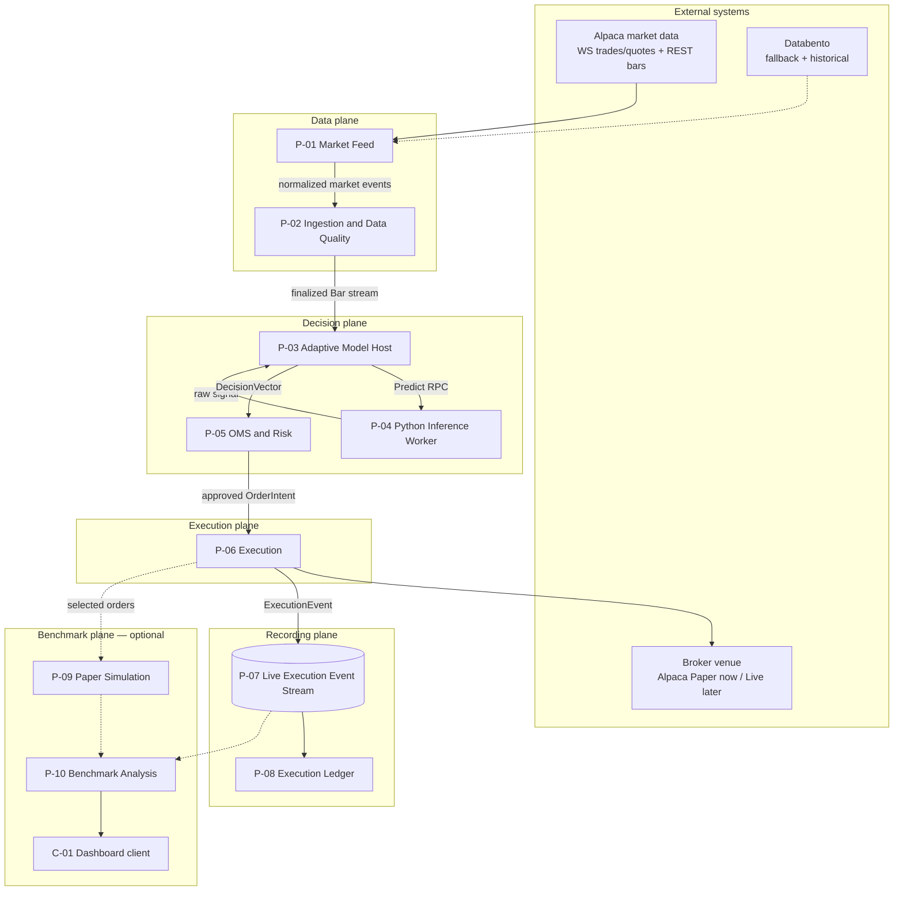
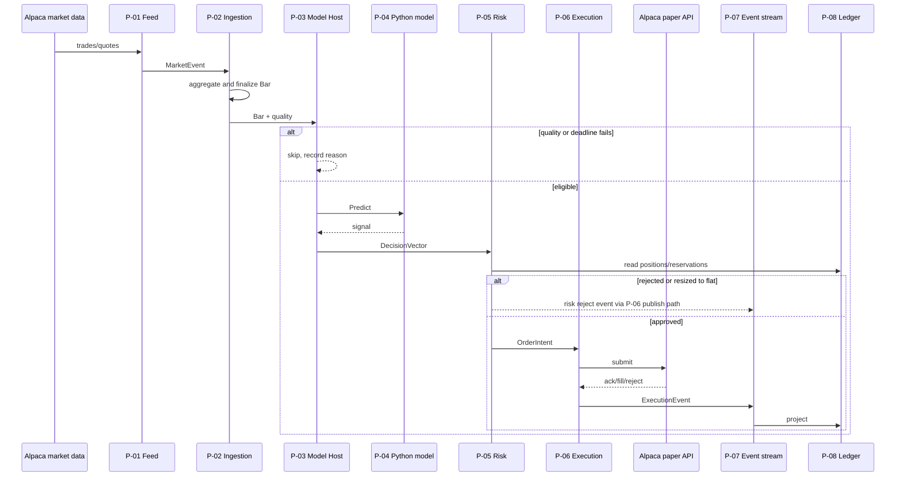

# QuanTRAM Process Model

**Date:** August 29, 2026  
**Status:** Process decomposition and service-contract proposal  
**Parent Architecture:** [QuanTRAM System Specification](QuanTRAM_hi-level_design_082826.md)  
**Derived Artifact Specification:** [E2E QuanTRAM Artifacts](E2E_QuanTRAM_ARTIFACTS.md)  
**Open Design Gaps:** [QuanTRAM Decision Integrity and Design Gap Analysis](QuanTRAM_DECISION_INTEGRITY_GAP_ANALYSIS_082826.md)

**Increment 1 (P-01 / P-02):** [QuanTRAM Ingestion Increment 1](QuanTRAM_INGESTION_INCREMENT_1_083026.md)  
**Increment 1 continuation (P-02 quality):** [P-02 Data Quality](QuanTRAM_INGESTION_P02_DATA_QUALITY_083126.md)  
**Next increment (P-03 design):** [Adaptive Model Host](QuanTRAM_P03_ADAPTIVE_MODEL_HOST_083126.md) · [Implementation](QuanTRAM_P03_IMPLEMENTATION_083126.md)

## 1. Purpose and Authority

This document translates the parent architecture diagram into a **process model**: named runtime units, their inputs and outputs, failure domains, scale axes, and gRPC contracts. It exists so QuanTRAM can define microservices and `quantram.proto` from process boundaries rather than from package folders.

The parent architecture remains authoritative for system intent and end-to-end behavior. The artifact specification remains authoritative for Go package ownership, ports-and-adapters, and the single-file protobuf policy. This process model is authoritative for:

- logical process inventory and ownership
- required versus optional runtime paths
- east-west and northbound service surfaces
- local paper-trading topology and later Azure scale-out
- how the existing Python adaptive model joins the live path

Process names here do not force one container per process on day one. A process is a **logical runtime unit** with a contract, a scale axis, and a failure domain. A binary or container may host one or more processes until an independent-scaling or isolation need is demonstrated.

QuanTRAM v1 is limited to U.S. stocks, ETFs, and published market indices. Indices remain analytics-only and must never become broker orders.

## 2. Why Processes Before Proto

The architecture diagram is a data-flow picture. A proto file needs **callers, callees, streaming versus unary, and who owns state**. Those are process questions:

| Architecture box | Process question the proto must answer |
| :--- | :--- |
| Alpaca SIP / Databento | Who owns reconnect, credentials, and provider schemas? |
| Circuit breaker and failover | Who decides the active source and when inference may resume? |
| OHLCV aggregator and gap-filler | Who emits the canonical bar stream, and is it pull or push? |
| Adaptive Model Engine | Is inference in-process Go, a Python sidecar, or both? |
| OMS and Risk Guardrails | Who holds reserved exposure and kill switches? |
| Execution Router / broker adapter | Who is allowed to call a broker, and under which venue? |
| Live Execution Events sink | Is this a gRPC service or a durable log? |
| Ledger | Who is the source of truth for positions and PnL? |
| Paper engine / benchmark | Which work may fail without touching the live path? |

The answer used throughout this document: **gRPC defines service contracts; a durable event log carries high-volume and multi-consumer facts; in-process channels are an allowed transport only while processes are collocated.**

## 3. Process Model Principles

1. **One owner per fact.** A bar, decision, risk reservation, broker order, or ledger projection has a single writing process.
2. **Required path is isolated from optional path.** Paper simulation, correlation, telemetry storage, and the dashboard must never delay or reject a live or paper-venue order.
3. **Ticks do not cross unary gRPC.** Trade and quote ingress stays inside the feed and ingestion processes. Downstream consumers see **finalized bars** and snapshots, not raw tick RPCs.
4. **Decisions are request-response.** Model evaluation, risk evaluation, and order submit are unary (or short client-stream) RPCs so deadlines, idempotency keys, and rejection reasons stay explicit.
5. **Execution facts are events.** Broker acknowledgments, fills, cancels, and rejects are append-only stream records. Ledger and benchmark are independent consumers.
6. **Python is an inference worker, not the control plane.** The existing offline-tested model stays behind a versioned inference contract. Go owns identifiers, quality gating, risk, routing, and recording.
7. **Contracts outlive topology.** Local single-binary, local multi-process, and Azure AKS must implement the same proto and event envelopes.
8. **Fail closed on the live path.** Unknown data quality, expired decisions, non-tradable indices, and kill switches produce auditable rejects. Observation may continue when submission must stop.
9. **Open integrity gaps remain open.** This model names the processes that will enforce DI/RV/OP decisions; it does not close those gaps.

## 4. Process Inventory

Processes are numbered `P-01` through `P-10`. `C-01` is a client, not a core server.

| ID | Process | Architecture box | Path | Scale axis | Initial language |
| :--- | :--- | :--- | :--- | :--- | :--- |
| P-01 | Market Feed | Alpaca SIP, Databento | Required data | Connection and universe shard | Go |
| P-02 | Ingestion and Data Quality | Circuit breaker, failover, OHLCV aggregator, REST gap-filler | Required data | Symbol shard | Go |
| P-03 | Adaptive Model Host | Adaptive Model Engine (Go orchestration) | Required decision | Symbol shard | Go |
| P-04 | Model Inference Worker | Adaptive Model Engine (existing Python model) | Required decision | Symbol shard / replica | Python |
| P-05 | OMS and Risk | OMS and Risk Guardrails | Required decision | Account (single writer) | Go |
| P-06 | Execution | Execution Router, Live Broker Adapter | Required execution | Account / venue connection | Go |
| P-07 | Live Execution Event Stream | Live Execution Events sink | Required recording | Partition by account or order | Log (not a domain RPC) |
| P-08 | Execution Ledger | Authoritative ledger and audit store | Required recording | Account | Go |
| P-09 | Paper Simulation | Paper Execution Engine | Optional benchmark | Symbol / order | Go |
| P-10 | Benchmark Analysis | Correlation engine, telemetry store | Optional benchmark | Time range / strategy | Go |
| C-01 | Harness Dashboard | Harness Benchmark Dashboard | Optional read | Stateless replicas | Any gRPC client |

P-01 and P-02 form the **data plane**. P-03 through P-06 form the **decision and execution plane**. P-07 and P-08 form the **recording plane**. P-09 and P-10 form the **benchmark plane**.

### 4.1 Two meanings of “paper”

The architecture diagram and the local test plan use “paper” for different things. They must not be collapsed.

| Name | What it is | Process | Local Phase 0 |
| :--- | :--- | :--- | :--- |
| **Venue: Alpaca Paper** | Alpaca’s paper brokerage API. QuanTRAM treats it as the configured broker. | P-06 | **On.** This is the execution venue for local testing. |
| **Internal paper engine** | QuanTRAM’s L2 fill simulator for live-versus-modeled comparison. | P-09 | **Off** unless benchmark mode is `SAMPLED` or `FULL`. |

Local testing therefore runs a **real execution path** against Alpaca paper. It does not require P-09. When live brokerage is later enabled, P-06 points at the live Alpaca (or IBKR) adapter and P-09 may mirror selected orders.

## 5. Logical Process Map

This is the parent diagram restated as processes and contracts. Solid arrows are the required path. Dashed arrows are optional benchmark work.



## 6. Process Catalog

Each process lists what it owns, what it consumes and produces, how it fails, how it scales, and which proto service it implements. Open integrity gaps that this process must later enforce are cited by ID.

### 6.1 P-01 Market Feed

**Owns:** Provider sessions, reconnect loops, credential retrieval, provider-payload decoding, instrument classification at ingress.

**Consumes:** Alpaca SIP or IEX WebSocket trades and quotes; Alpaca REST bars; later Databento real-time and historical.

**Produces:** Provider-tagged `MarketEvent` candidates with source timestamp, local receipt timestamp, `InstrumentType`, and tradability metadata. Does not emit canonical bars.

**Does not own:** Source selection, bar construction, model state, orders.

**Failure domain:** A provider disconnect must not crash ingestion. P-01 reports `FeedHealth` to P-02 and retries with exponential backoff. Secrets never enter logs or domain events.

**Scale:** Horizontal by symbol universe shard or by provider connection. Alpaca session limits are the practical cap.

**Proto:** `MarketFeedService` (northbound health and active-source queries). East-west tick handoff to P-02 is an internal stream or in-process channel, not a public unary RPC.

**Gaps:** DI-01, DI-04, DI-05, OP-03, OP-07.

**Local Phase 0:** Alpaca only. Databento adapter may exist as a stub. Use the Alpaca feed the account is entitled to (IEX or SIP). Record the feed product in every event so a later SIP upgrade is visible in provenance.

### 6.2 P-02 Ingestion and Data Quality

**Owns:** Heartbeat evaluation, circuit-breaker state, failover and failback, normalization, OHLCV aggregation, gap detection, REST backfill, rolling windows, bar finalization, quality flags.

**Consumes:** `MarketEvent` from P-01; historical bars from P-01’s `HistoricalBarSource` during recovery.

**Produces:** A continuous, causally ordered `Bar` stream with `quality_status`, `is_final`, `is_backfilled`, `source`, `source_transition`, `data_age`, and `market_snapshot_id`. Also emits ingestion health and capability flags (`observe`, `infer`).

**Does not own:** Signals, risk, orders. Must **quarantine** inference (tell P-03 to pause) when continuity cannot be proven.

**Failure domain:** Unhealthy or reconciling ingestion disables new inference and new submissions while remaining able to observe and recover. It does not cancel in-flight broker orders.

**Scale:** Partition by symbol. Each shard owns open-bar state for its symbols. Do not share mutable open bars across processes.

**Proto:** `IngestionService` — `StreamBars`, `GetBarWindow`, `TriggerGapFill` (ops). Heartbeat remains 1000 ms; three consecutive failures or latency above 1500 ms still trip failover as specified in the parent.

**Gaps:** DI-01, DI-02, DI-03, DI-04, DI-06. This is the highest-risk process until those gaps close.

**Local Phase 0:** Single shard, Alpaca-only source, REST gap-fill after reconnect. Circuit breaker may have no alternate source; in that case the state is `failed` or `degraded`, not a silent Databento switch.

### 6.3 P-03 Adaptive Model Host

**Owns:** Subscription to finalized bars, feature-window assembly, `signal_id` / `decision_id` generation, model-deadline watchdog, mapping of Python output into a QuanTRAM `DecisionVector`, decision provenance records.

**Consumes:** Finalized bars and quality metadata from P-02; model version and raw scores from P-04.

**Produces:** Versioned `DecisionVector` (side, confidence, target size, entry/exit conditions, quality and regime fields) or an explicit skip. Never sends orders.

**Does not own:** Risk limits, broker calls, or the Python numeric model.

**Failure domain:** Inference timeout, sidecar unavailability, or stale bars produce **no new order**, not a reused previous signal (OP-05). P-03 stays up and reports model-host health separately from feed health.

**Scale:** Horizontal by symbol shard. Stateless with respect to portfolio. Rolling feature state is either rebuilt from P-02 windows or owned per shard with explicit reset on session boundary.

**Proto:** `ModelService` — `Evaluate` (east-west, used when a caller pushes a snapshot), `StreamDecisions` (server stream of decisions as bars finalize), `GetModelInfo`.

**Gaps:** DI-06, DI-07, MV-01, OP-05.

### 6.4 P-04 Model Inference Worker

**Owns:** The existing Python adaptive model, its weights or rule parameters, and the numeric transform already validated on offline OHLCV CSV.

**Consumes:** `PredictRequest`: ordered bar window, optional precomputed features, instrument id, interval, quality flags, model-config version. The window must be the same contract used by the offline CSV harness.

**Produces:** `PredictResponse`: raw signal class or score, confidence, optional size hint, model version, and any internal diagnostics the host is allowed to persist.

**Does not own:** Identifiers, risk, tradability, session calendar, or broker semantics. It must not call Alpaca.

**Failure domain:** A worker crash is contained. P-03 marks inference unhealthy and skips. Restart must not require P-02 or P-06 restart.

**Scale:** Replicas behind P-03. Prefer sticky symbol assignment if the model is stateful; prefer any replica if it is stateless per request. Document which of those the current Python model is.

**Proto:** `ModelInferenceService` in the same `quantram.v1` package. Implemented by Python `grpcio`. Go generated stubs are clients only.

**Local Phase 0:** One sidecar on localhost. Load the same model artifact used for CSV tests. A replay mode must accept a recorded bar window and return the same `PredictResponse` as the offline path within a documented numeric tolerance.

### 6.5 P-05 OMS and Risk

**Owns:** Risk policy version, limit evaluation, pending-exposure reservation, kill switches, last-moment data-age and tradability checks, machine-readable reject/resize reasons.

**Consumes:** `DecisionVector` from P-03; portfolio, cash, and working-order state from P-08 (and local reservation memory); current spread/snapshot age from P-02 or a snapshot reference on the decision.

**Produces:** `RiskDecision`: approved, resized, or rejected `OrderIntent` with `decision_id` preserved. Approved intents are the only inputs P-06 may submit.

**Does not own:** Broker sessions or ledger projections. It **reserves** exposure; P-08 **confirms** it after fills.

**Failure domain:** Risk unavailability or uncertain exposure is fail-closed for new submits. Cancels of working orders may still be allowed per the capability matrix (RV-03).

**Scale:** **Single writer per account.** Horizontal scale is by account, not by symbol. This is the consistency bottleneck and must stay small and correct.

**Proto:** `RiskService` — `Evaluate`, `GetPortfolioView`, `SetKillSwitch` (also mirrored on `OperationsService` for operators), `GetRiskPolicy`.

**Gaps:** RV-01, RV-02, RV-03, DI-05 (index reject), DI-06 (data-age recheck).

### 6.6 P-06 Execution

**Owns:** Venue selection, idempotent broker submit/cancel, broker-protocol translation, assignment of `order_id` and optional `benchmark_id`, fan-out to P-09 when policy selects the order, publication of lifecycle events to P-07.

**Consumes:** Risk-approved `OrderIntent`. Broker acknowledgments, rejects, replaces, cancels, and fills.

**Produces:** Broker-facing orders; `ExecutionEvent` records; optional handoff to P-09. Must not wait on P-09, P-10, or C-01.

**Does not own:** Portfolio truth (P-08) or signal generation.

**Failure domain:** Broker disconnect disables new live/paper-venue submits and keeps cancel/reconcile capabilities as defined by RV-03. Event-publish failure is a **live-path fault**: if an order was sent and the event cannot be recorded, the process must enter a degraded execution state and reconcile rather than silently continue (OP-01, OP-02).

**Scale:** One process (or session manager) per venue connection and account. Throughput is order-rate, not tick-rate.

**Proto:** `ExecutionService` — `SubmitOrder`, `CancelOrder`, `GetOrderStatus`, `StreamOrderUpdates`.

**Local Phase 0:** `AlpacaBrokerAdapter` with base URL `https://paper-api.alpaca.markets`. Trading mode is `PAPER_VENUE`, not `LIVE_VENUE`. Benchmark mode defaults to `OFF`.

### 6.7 P-07 Live Execution Event Stream

**Owns:** Durable, append-only delivery of `ExecutionEvent`. Independent consumer checkpoints. Partitioning and retention policy (once OP-02 is decided).

**Consumes:** Events published by P-06. Does not interpret them.

**Produces:** Ordered (within partition key) event log to P-08 and, optionally, to P-10.

**This is infrastructure, not a domain gRPC service.** Local candidates: NATS JetStream, or an embedded outbox plus Postgres. Azure candidates: Event Hubs or a Kafka-compatible log. The Go ports remain `ExecutionEventPublisher` and `ExecutionEventConsumer`.

**Failure domain:** Separate from P-10. Ledger consumption must continue if benchmark consumption stops.

**Gaps:** OP-02, OP-04.

### 6.8 P-08 Execution Ledger

**Owns:** Authoritative orders, fills, positions, cash, fees, PnL projections, broker reconciliation views, audit retention of applied events.

**Consumes:** P-07 events. Broker snapshot queries during reconcile.

**Produces:** Queryable execution state for P-05, operators, and C-01. Never takes writes from the dashboard.

**Scale:** Write path is the P-07 consumer (one active projector per account partition). Read replicas are allowed for queries.

**Proto:** `LedgerService` — order, fill, position, cash, PnL, and reconciliation queries with pagination.

**Local Phase 0:** Postgres or SQLite via the `ExecutionLedger` port. SQLite is acceptable for single-host paper testing if the port stays technology-neutral.

### 6.9 P-09 Paper Simulation

**Owns:** Internal L2 fill model, simulated execution events, simulator version.

**Consumes:** Selected `OrderIntent` copies at live/paper-venue submit time, plus a contemporaneous L2 or quote snapshot.

**Produces:** `PaperExecutionEvent` to P-10 only.

**Must:** Bound queues and drop or degrade optional work rather than block P-06.

**Proto:** No northbound mutate API. Optional internal `PaperService.Simulate` for tests. Results are read through `BenchmarkService`.

**Gaps:** BV-01. Keep **off** for local Alpaca-paper testing.

### 6.10 P-10 Benchmark Analysis

**Owns:** Pairing by `benchmark_id`, derived fill/latency/slippage/PnL comparison records, benchmark-mode configuration persistence.

**Consumes:** Selected live events from P-07 and paper events from P-09.

**Produces:** Query and stream APIs for C-01.

**Proto:** `BenchmarkService` — summary, comparisons, metric stream, authenticated mode change.

**Local Phase 0:** Optional. Dashboard is not required to paper-trade.

### 6.11 C-01 Harness Dashboard

Read-only gRPC client of `BenchmarkService`, `LedgerService`, `MarketFeedService`, and `OperationsService`. Not a core microservice. May be deferred until P-08 queries exist.

### 6.12 Cross-cutting: Operations

Every server process exposes the same health surface so RV-03 can be implemented without a hidden shared status bit.

**Proto:** `OperationsService` — aggregate health, readiness, capability matrix (`observe`, `infer`, `submit`, `cancel`, `reconcile`, `benchmark`), kill switches, config version.

A dedicated ops binary is unnecessary locally. Each Go process registers `OperationsService` on its gRPC server; a later Azure ingress can aggregate.

## 7. End-to-End Process Flows

### 7.1 Required bar-to-venue path

This is the path that must work on this machine with Alpaca live data and Alpaca paper trading.



Identifier chain on a successful order: `market_snapshot_id` → `signal_id` → `decision_id` → `order_id` → `broker_order_id` → `event_id`. Optional `benchmark_id` is assigned in P-06 only when P-09 is selected.

### 7.2 Feed interrupt and inference quarantine

1. P-01 detects socket loss or heartbeat failure and reports unhealthy Alpaca.
2. P-02 trips the breaker, records `T_last`, and sets capability `infer=false`, `submit=false`.
3. P-01 reconnects with backoff. P-02 REST-backfills `[T_last, T_now]`, deduplicates, and rebuilds or quarantines open bars (DI-03 still to be specified).
4. Only after continuity is proven does P-02 set `infer=true`. P-05 still rechecks data age before any new submit.
5. With no Databento locally, there is no failover source. The process model still has the Databento port so Phase 2 can attach it without changing P-03 through P-08.

### 7.3 Offline CSV versus live inference

The Python model has already been tested on offline OHLCV CSV. Live trading is only valid if that path and P-04 share one contract.

| Step | Offline harness | Live path |
| :--- | :--- | :--- |
| Bar source | CSV rows | P-02 finalized bars |
| Window | Same length, interval, and column set | Same `PredictRequest` window |
| Features | Computed in Python or precomputed in the harness | P-03 may precompute; fields must match |
| Output | Signal used for backtest metrics | `PredictResponse` wrapped as `DecisionVector` |
| Risk / broker | Usually absent | P-05 then P-06 |
| Provenance | File name and row range | `market_snapshot_id`, versions, quality |

Promotion rule (MV-01, still open): a live decision is not trusted until a replay of stored `PredictRequest` bodies reproduces the offline and live scores. P-03 must persist enough input to do that replay without reading mutable current bars.

### 7.4 Optional benchmark path

Enabled only when benchmark mode is `SAMPLED` or `FULL`:

1. P-06 assigns `benchmark_id` and submits to the venue without waiting.
2. P-06 enqueues a copy plus snapshot reference to P-09.
3. P-09 simulates and emits paper events.
4. P-10 correlates with selected P-07 events and stores derived metrics.
5. C-01 queries P-10 and P-08.

If the P-09 queue is full, P-06 logs a dropped-mirror event and continues. That drop must not fail the venue submit.

## 8. Communication Model

Three planes, three transports.

| Plane | Content | Transport | Latency class |
| :--- | :--- | :--- | :--- |
| Data | Ticks inside P-01/P-02; finalized bars out of P-02 | In-process channel if collocated; gRPC `StreamBars` or a bus if split | Tick-rate / bar-rate |
| Decision | Predict, risk evaluate, submit, cancel | gRPC unary with deadlines and idempotency keys | Milliseconds |
| Recording | Execution and paper events | Durable log with independent checkpoints | Asynchronous |

### 8.1 Collocated transport rule

While P-01, P-02, P-03, P-05, P-06, and P-08 share a process, they **call Go interfaces**, not loopback gRPC. Generated proto types stay at the process edge. This matches the artifact specification and keeps the local hot path off the serialization tax.

When a process is split out, the same interface is satisfied by a gRPC adapter. That is the move from “one binary” to “microservice” without redesigning the domain.

### 8.2 P-04 is always out of process

The Python worker is a separate OS process even in Phase 0. The host uses localhost gRPC (or a UDS on Linux; TCP `127.0.0.1` on this Windows machine). That is the one east-west RPC that exists from the first integration test.

### 8.3 Backpressure

| Boundary | Policy |
| :--- | :--- |
| Alpaca WS → P-01 | Provider-limited. If local queues fill, drop quotes before trades and mark quality degraded. Never block the socket read until memory is exhausted. |
| P-02 → P-03 | P-03 consumes finalized bars only. If inference lags, skip the bar and record a deadline miss; do not let an unbounded queue replay stale bars as if they were live. |
| P-03 → P-04 | RPC deadline from OP-05 (provisional: 50 ms for 1s bars, 200 ms for 1m bars). On timeout, skip. |
| P-05 | In-process, account-serialized. No queue of unreserved intents. |
| P-06 → venue | Broker rate limits. Excess intents reject with `RATE_LIMIT`. |
| P-06 → P-07 | Publish with timeout. Failure degrades submit capability. |
| P-06 → P-09 | Bounded queue, drop-oldest or shed. |

## 9. Proposed gRPC Surface

Single file, per the artifact policy:

```text
api/proto/quantram/v1/quantram.proto
```

Package: `quantram.v1`. Organize the file by area: common types, market data, model, risk, execution, ledger, benchmark, operations, then service definitions. Do not split the file until review or generation friction is demonstrated.

### 9.1 Services and RPC sketch

This sketch is the input to the first proto authoring pass. Field lists belong in the proto; behavior belongs here.

```text
service MarketFeedService {
  rpc GetFeedHealth(GetFeedHealthRequest) returns (FeedHealth);
  rpc GetActiveSource(GetActiveSourceRequest) returns (ActiveSource);
  rpc StreamFeedHealth(StreamFeedHealthRequest) returns (stream FeedHealthEvent);
}

service IngestionService {
  rpc StreamBars(StreamBarsRequest) returns (stream Bar);
  rpc GetBarWindow(GetBarWindowRequest) returns (BarWindow);
  rpc TriggerGapFill(TriggerGapFillRequest) returns (GapFillResult);
}

service ModelService {
  rpc Evaluate(EvaluateRequest) returns (DecisionVector);
  rpc StreamDecisions(StreamDecisionsRequest) returns (stream DecisionEvent);
  rpc GetModelInfo(GetModelInfoRequest) returns (ModelInfo);
}

service ModelInferenceService {
  rpc Predict(PredictRequest) returns (PredictResponse);
  rpc GetModelVersion(GetModelVersionRequest) returns (ModelVersion);
  rpc ResetState(ResetStateRequest) returns (ResetStateResponse);
}

service RiskService {
  rpc Evaluate(EvaluateOrderRequest) returns (RiskDecision);
  rpc GetPortfolioView(GetPortfolioViewRequest) returns (PortfolioView);
  rpc GetRiskPolicy(GetRiskPolicyRequest) returns (RiskPolicy);
  rpc SetKillSwitch(SetKillSwitchRequest) returns (KillSwitchState);
}

service ExecutionService {
  rpc SubmitOrder(SubmitOrderRequest) returns (SubmitOrderResponse);
  rpc CancelOrder(CancelOrderRequest) returns (CancelOrderResponse);
  rpc GetOrderStatus(GetOrderStatusRequest) returns (OrderStatus);
  rpc StreamOrderUpdates(StreamOrderUpdatesRequest) returns (stream OrderUpdate);
}

service LedgerService {
  rpc GetOrder(GetOrderRequest) returns (OrderRecord);
  rpc ListOrders(ListOrdersRequest) returns (ListOrdersResponse);
  rpc GetPosition(GetPositionRequest) returns (Position);
  rpc ListPositions(ListPositionsRequest) returns (ListPositionsResponse);
  rpc GetAccountPnL(GetAccountPnLRequest) returns (PnLReport);
  rpc GetReconciliation(GetReconciliationRequest) returns (ReconciliationReport);
}

service BenchmarkService {
  rpc GetSummary(GetSummaryRequest) returns (BenchmarkSummary);
  rpc ListComparisons(ListComparisonsRequest) returns (ListComparisonsResponse);
  rpc StreamMetrics(StreamMetricsRequest) returns (stream BenchmarkMetricEvent);
  rpc SetBenchmarkMode(SetBenchmarkModeRequest) returns (BenchmarkModeState);
}

service OperationsService {
  rpc GetHealth(GetHealthRequest) returns (HealthReport);
  rpc GetReadiness(GetReadinessRequest) returns (ReadinessReport);
  rpc GetCapabilities(GetCapabilitiesRequest) returns (CapabilityMatrix);
  rpc SetKillSwitch(SetKillSwitchRequest) returns (KillSwitchState);
}
```

`SetBenchmarkMode` and kill-switch RPCs are operator APIs. They require authentication once that gap (OP-03 / rollout) is specified. C-01 must not call them in ordinary dashboard use.

### 9.2 Shared types the proto must include

From the parent and artifact specs, plus this process model:

- IDs: `event_id`, `signal_id`, `decision_id`, `order_id`, `broker_order_id`, `benchmark_id`, `market_snapshot_id`, `account_id`, `strategy_id`, `instrument_id`
- `InstrumentType`: `STOCK`, `ETF`, `INDEX`
- `Tradability` and `SessionState`
- `QualityStatus`: complete, degraded, stale, partial, reconstructed, invalid
- `RiskOutcome`: approved, resized, rejected
- `BenchmarkMode`: `OFF`, `SAMPLED`, `FULL`
- `TradingVenue`: `ALPACA_PAPER`, `ALPACA_LIVE`, `IBKR_LIVE`
- `Capability`: observe, infer, submit, cancel, reconcile, benchmark
- Bar, DecisionVector, OrderIntent, ExecutionEvent, and pagination/filter messages

Generated protobuf types **do not** become the Go or Python domain model. Each language maps at its adapter boundary.

### 9.3 What stays out of proto

- Raw provider payloads
- Credentials
- Tick-by-tick public subscribe (ticks stay inside P-01/P-02)
- Direct SQL or file paths
- Azure-specific resource IDs

## 10. Scalability Model

Realtime load is dominated by **market events**, not orders. Design for that split.

### 10.1 Volume classes

| Class | Approximate rate | Owning processes | Scale method |
| :--- | :--- | :--- | :--- |
| Ticks (trades/quotes) | High, bursty | P-01, P-02 | Symbol shards; keep in the data plane |
| Finalized bars | Interval × symbols | P-02 → P-03 | Stream or bus; shard with symbols |
| Inference | Bars that pass quality gates | P-03, P-04 | Replicas / GPU later |
| Risk + submit | Sparse | P-05, P-06 | Single writer per account |
| Execution events | Per order lifecycle | P-07, P-08 | Partitioned log |
| Benchmark | Subset of orders | P-09, P-10 | Independent consumer lag |

### 10.2 Independent scale-out triggers

Split a collocated process into its own service when one of these is true:

| Trigger | First split |
| :--- | :--- |
| Ingestion CPU or memory grows with universe size | P-01+P-02 out of the decision binary |
| Python inference latency or RAM contends with Go | already split (P-04); add P-04 replicas |
| Risk evaluation blocks on ledger reads | cache account state in P-05; keep P-08 as source of truth |
| Dashboard or replay queries slow ledger writes | read replica or separate query API in front of P-08 |
| Benchmark backlog | scale P-10 only |
| Multiple accounts or strategies | shard P-05/P-06/P-08 by `account_id` |

### 10.3 Provisional latency budgets

OP-05 is still open. Until it is closed, use these as engineering targets, not production SLOs:

| Stage | 1s bars | 1m bars |
| :--- | :--- | :--- |
| Tick apply inside P-02 | 2 ms p99 | 2 ms p99 |
| Bar finalize to P-03 start | 5 ms | 20 ms |
| P-04 Predict | 50 ms deadline | 200 ms deadline |
| P-05 Evaluate | 10 ms | 10 ms |
| P-06 submit call start | 10 ms local | 10 ms local |
| Venue RTT | Alpaca-bound | Alpaca-bound |

If Predict exceeds its deadline, skip. Prefer no order over a late order.

### 10.4 State that prevents naive scale-out

- Open bars and rolling windows: sticky to a P-02 shard.
- Account exposure and kill switches: sticky to one P-05 writer.
- Broker session: sticky to one P-06.
- Ledger projections: single active consumer per partition.

## 11. Runtime Topologies

### 11.1 Phase 0 — this machine, Alpaca data, Alpaca paper

Goal: exercise the required path with live market data and non-live money.

```text
localhost
  quantram-core.exe          P-01 P-02 P-03 P-05 P-06 P-08 + Operations
       | localhost gRPC
  python model_worker        P-04 ModelInferenceService
       |
  optional NATS or Postgres  P-07 (or core-embedded outbox)
       |
  Alpaca data WS/REST        live quotes/trades/bars
  Alpaca paper-api           orders, fills
```

**On:** P-01 (Alpaca), P-02, P-03, P-04, P-05, P-06 (paper venue), P-07, P-08.  
**Off:** Databento, P-09, P-10, C-01, live venue.

**Suggested local config**

| Setting | Phase 0 value |
| :--- | :--- |
| `trading_venue` | `ALPACA_PAPER` |
| `benchmark_mode` | `OFF` |
| `feed_product` | Alpaca IEX or SIP as entitled |
| `databento_enabled` | false |
| `bar_interval` | match the offline model (start with the CSV interval) |
| `kill_switch` | on until an operator enables submit |
| `universe` | small symbol list used in CSV tests |

**Suggested commands / packages** (aligns with the artifact tree, adds the Python worker):

```text
cmd/quantram-server          collocated Go processes
cmd/quantram-model-worker    optional Go wrapper; or python -m quantram.inference
internal/marketfeed
internal/ingestion
internal/analytics
internal/model/grpcclient
internal/risk
internal/execution
internal/liveevents
internal/ledger
internal/paper               compiled, not started
internal/benchmark           compiled, not started
internal/transport/grpc
api/proto/quantram/v1/quantram.proto
```

### 11.2 Phase 1 — local multi-process (still this machine)

Split only if Phase 0 proves contention:

```text
quantram-ingest     P-01 P-02
quantram-model      P-03 + sidecar P-04
quantram-risk       P-05
quantram-exec       P-06
quantram-ledger     P-08
NATS JetStream      P-07
```

Bars move by `IngestionService.StreamBars` or a JetStream subject `bars.finalized.{interval}.{symbol}`. Decisions stay unary gRPC.

### 11.3 Phase 2 — Databento attach

P-01 gains the Databento adapter. P-02 gains a real alternate source. No change to P-03–P-08 contracts. Do not enable failover for production decisions until DI-01 and DI-03 exit criteria exist.

### 11.4 Phase 3 — Azure

Same processes, different hosts.

| Process | Azure mapping (indicative) |
| :--- | :--- |
| P-01, P-02 | AKS Deployment, HPA on CPU; or Container Apps |
| P-03 | AKS, symbol-sharded |
| P-04 | AKS sidecar or dedicated inference Deployment; GPU node pool only if the model needs it |
| P-05, P-06 | AKS, replica 1 per account writer; pod anti-affinity later |
| P-07 | Event Hubs or managed NATS; keep the Go ports |
| P-08 | AKS + Azure Database for PostgreSQL |
| P-09, P-10 | Separate Deployment; scale to zero when mode is `OFF` |
| C-01 | Static web app or small Container App |
| Secrets | Key Vault; `FeedCredentialsProvider` / broker credential port |
| Observability | Azure Monitor / OpenTelemetry; do not parse free-form logs for dashboard metrics |

AKS ingress exposes northbound services (`Operations`, `Ledger`, `Benchmark`, `Execution` cancel/status). East-west stays on the cluster service mesh or internal load balancers. Trading credentials never go on a public ingress.

Live venue (`ALPACA_LIVE` or IBKR) is an environment change in P-06 plus Gate B in the gap analysis. It is not a new process.

## 12. Capability Matrix (process-level)

RV-03 requires independent health domains. Until that gap closes, processes must at least emit these capabilities.

| Condition | observe | infer | submit | cancel | reconcile | benchmark |
| :--- | :---: | :---: | :---: | :---: | :---: | :---: |
| All required processes healthy, venue connected | yes | yes | yes | yes | yes | if enabled |
| Feed degraded, bars still finalized with quality flag | yes | strategy policy | P-05 recheck | yes | yes | if enabled |
| Ingestion reconciling / gap filling | yes | no | no | yes | yes | if enabled |
| P-04 down | yes | no | no | yes | yes | if enabled |
| P-05 kill switch | yes | optional | no | yes | yes | if enabled |
| Venue disconnected | yes | optional | no | no* | yes | if enabled |
| P-07 publish failing | yes | no** | no | yes | yes | no |
| P-10 down | yes | yes | yes | yes | yes | no |

\* Cancel may still be attempted depending on broker session state; define in OP-01.  
\*\* Prefer no new inference that can create submits while recording is unsafe.

## 13. Implementation Sequence

This replaces “start coding services in diagram order” with a contract-first sequence that still matches the parent roadmap.

| Step | Status | Deliverable | Processes | Exit |
| :--- | :--- | :--- | :--- | :--- |
| S0 | **Partial** | `quantram.proto` increment-1 services generated in Go. Risk, execution, ledger, benchmark, and Python stubs are not in the file yet. | contracts | Ingestion/ops RPCs compile. Full-file golden round-trip still open. |
| S1 | **Partial** | Alpaca IEX/test WebSocket, REST historical client, CSV replay, thin reconnect, bar window, `StreamBars`. Full circuit breaker is **not completed** and is **deferred**. See [Increment 1](QuanTRAM_INGESTION_INCREMENT_1_083026.md). | P-01, P-02 | CSV and Alpaca test-feed bars received 2026-08-30. Near-term exit is IEX RTH. Failover, live gap-fill proof, and DI-01 qualification are later. |
| S2 | **Partial** | Adaptive model as a Go black box (Phases A–C). Pricing later: Go EXPM only; oracle is SADE `solve_cover_rk45_reference` (frozen APTF `run_test_013b_qqq_validation.py::solve_cover`), not an APTF repo dependency and not a runtime call. | P-03 | Frozen CSV replay matches the Python baseline (Unit Run 001 done). |
| S3 | Not started | Model host assigns IDs and skips on quality/deadline | P-03 | No decision without snapshot id and quality |
| S4 | Not started | Risk rules + kill switch; index intents rejected | P-05 | Auditable reject reasons |
| S5 | Not started | Alpaca paper submit/cancel + event publish + ledger | P-06, P-07, P-08 | Paper fill appears in ledger; restart is idempotent |
| S6 | Deferred | Databento adapter and **full circuit breaker** (failover, failback, production trip rules). Thin Alpaca reconnect in increment 1 does not count as done. | P-01, P-02 | Only after IEX E2E, the model/paper slice, and DI-01/DI-03 policy |
| S7 | Not started | Internal paper + correlation + dashboard client | P-09, P-10, C-01 | Benchmark stop does not affect paper-venue orders |

S1–S5 are the local paper-trading slice. S6–S7 are scale and measurement. S2 no longer assumes a whole-pipeline Python sidecar; that decision is recorded in the SADE Go investigation and the 2026-08-29 review.

## 14. Mapping to Existing Documents

| Topic | Where it lives |
| :--- | :--- |
| Layered architecture, feed SLAs, dashboard views, parent diagram | System specification |
| Go interfaces, packages, single proto file, acceptance criteria | E2E artifacts |
| Unresolved correctness and production gaps | Gap analysis |
| Runtime units, RPCs, local vs Azure topology, Python sidecar | This document |
| Increment 1 ingestion implementation and Alpaca/CSV evidence | [Ingestion Increment 1](QuanTRAM_INGESTION_INCREMENT_1_083026.md) |

This document **proposes** a resolution for the artifact specification’s open item “process decomposition and independent scaling thresholds.” It does not close P0/P1 gaps. Implementation of S1 decision-quality behavior still waits on Gate A (DI-01 through DI-07) for any path treated as a production decision contract. Provider adapters and the Python sidecar may be prototyped earlier if their outputs are labeled non-authoritative.

## 15. Decisions Made Here

| Decision | Choice |
| :--- | :--- |
| Process inventory | P-01 through P-10 plus C-01 |
| Local execution venue | Alpaca paper API via P-06 |
| Internal paper engine | Separate optional process P-09 |
| Existing Python model | P-04 sidecar implementing `ModelInferenceService` |
| Core control plane | Go gRPC |
| Tick transport | Not public unary gRPC |
| Proto layout | Still one `quantram.v1` file; services listed in §9 |
| Phase 0 packing | One Go server + Python worker |
| Split rule | Contract-preserving adapters when a scale or isolation trigger fires |
| Azure | Same processes; AKS + managed log + Postgres + Key Vault as the default sketch |
| Full circuit breaker | **Not completed.** Deferred until after Alpaca live/IEX E2E and the model/paper slice. Increment 1 keeps thin reconnect only. |

## 16. Still Open (owned by the gap register)

Do not invent silent defaults for these in code that will drive money or promotion:

- Canonical bar math and provider qualification (DI-01)
- Finalization, watermarks, and look-ahead (DI-02)
- Failover reconciliation (DI-03)
- Session and calendar policy (DI-04)
- Point-in-time reference data (DI-05)
- Quality gating policy (DI-06)
- Full provenance store layout (DI-07)
- Pending exposure (RV-01), stale-order rules (RV-02), exact capability matrix (RV-03)
- Event-log product and retention (OP-02)
- Authn/z for operator RPCs
- Paper-fill methodology (BV-01)

## 17. Change Log

| Date | Version | Change |
| :--- | :--- | :--- |
| August 30, 2026 | 0.3 | Deferred full circuit breaker / Databento failover (S6); increment-1 reconnect is not treated as complete. |
| August 30, 2026 | 0.2 | Marked S0/S1 partial after increment-1 ingestion implementation; linked the increment design; noted the adaptive model as a Go black box for S2. |
| August 29, 2026 | 0.1 | Initial process model: ten server processes, Python inference sidecar, gRPC sketch, local Alpaca-paper topology, Azure scale-out mapping, and required versus optional planes. |
