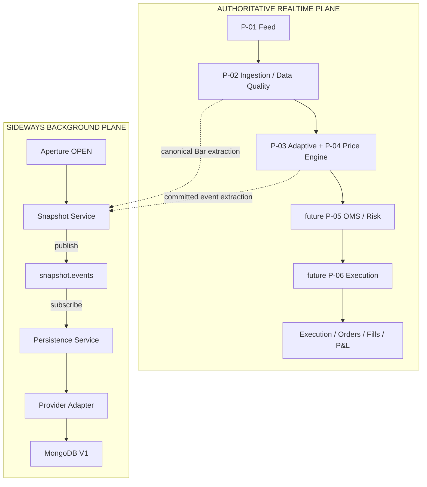
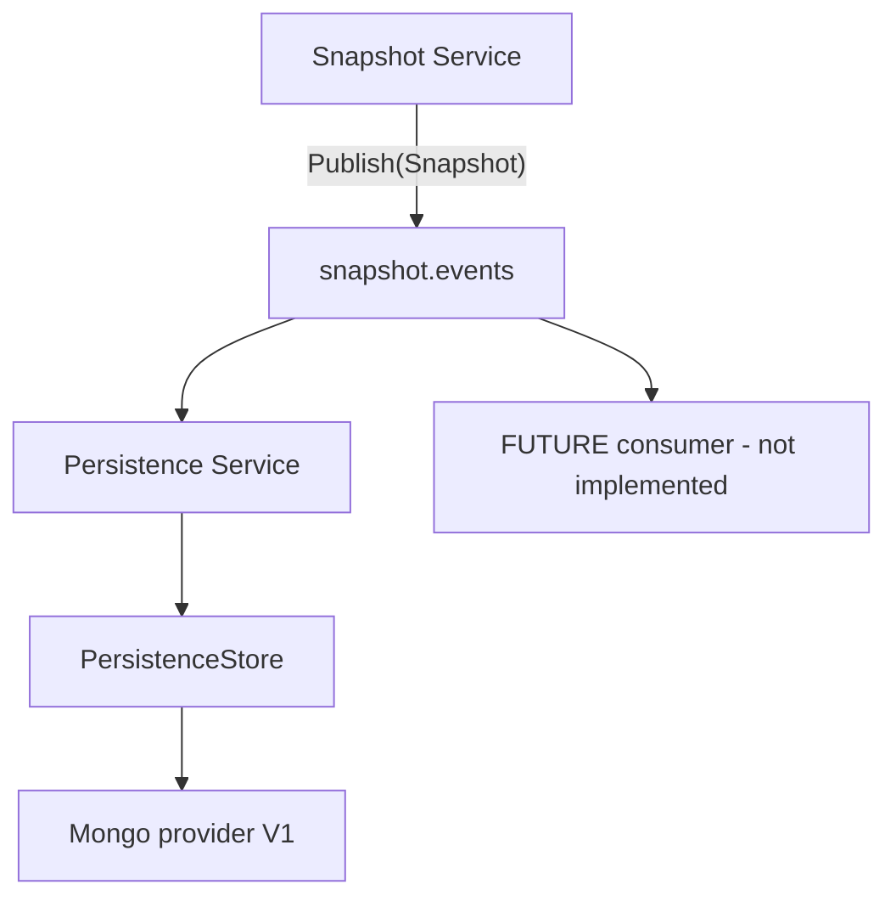
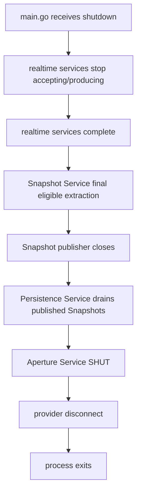

# QuanTRAM Snapshot + Persistence Pub/Sub Process Design

**Date:** September 4, 2026  
**Version:** 1.0  
**Status:** Design and implementation plan; ready for human review  
**Scope:** Realtime-safe sideways Snapshot extraction and asynchronous Snapshot persistence for the current P-01 through P-04 runtime and future processes  
**Branch reviewed:** `mongodb-persistene-v1`  
**Parent / authoritative references:** [QuanTRAM Process Model](QuanTRAM_PROCESS_MODEL_082926.md), [QuanTRAM P-04 Price Engine](QuanTRAM_P04_PRICE_ENGINE_090226.md), [QuanTRAM Semantic Contract V1](QuanTRAM_SEMANTIC_CONTRACT_V1_090226.md)  
**Implementation authorization:** **NOT YET AUTHORIZED**

## 1. Document Control

This document is the definitive combined design and migration plan for the Snapshot Process and Persistence Process. It is based on the repository state reviewed on September 4, 2026. It does not authorize Go, protobuf, MongoDB schema, dashboard, or runtime changes.

Normative words `MUST`, `MUST NOT`, `SHOULD`, and `MAY` express design requirements. Statements labeled **Current** report implemented behavior. Statements labeled **Target** define the proposed architecture. Statements labeled **Future** are deliberately outside V1.

## 2. Executive Overview

QuanTRAM's P-01 through P-04 realtime model remains authoritative. Snapshot and Persistence are sideways background processes, not new realtime stages. P-03 Adaptive and P-04 Price Engine remain collocated siblings on the same accepted eligible Bar, with their existing transactional prepare/commit and PriceEvent-before-DecisionEvent capture order unchanged.

The target separates four ownership domains:

1. **Aperture Service** owns the bounded runtime interval and OPEN/SHUT lifecycle.
2. **Realtime Services** own P-01 through P-04 work and future P-05/P-06 work.
3. **Snapshot Service** owns policy, extraction, consistency, identity, sequence, and publication.
4. **Persistence Service** subscribes to published Snapshots and owns bounded durability, retry, health, drain, and provider interaction.

V1 uses typed in-process Go contracts and bounded channels. Contracts permit a later external transport without changing Snapshot domain semantics. MongoDB remains the V1 provider, not the domain boundary.

The recommended durable-purpose model is a constrained hybrid:

- Snapshot Persistence consumes only published domain Snapshots.
- Full-fidelity raw realtime fact archival, if retained, is a separate background archival concern with a distinct contract and health surface.
- Future P-07/P-08 execution recording and ledger authority remain separate required-path infrastructure.
- Current direct `CaptureBar` / `CapturePrice` / `CaptureDecision` writes remain only during staged migration and equivalence proof; they are not the final Snapshot Persistence input.

## 3. Purpose

The purpose is to remove Snapshot creation semantics from MongoDB-backed durable scans and make Snapshot publication independent of successful persistence while preserving all realtime scientific and continuity behavior.

The target answers:

- where extraction occurs without adding a second model subscriber;
- what one provider-neutral Snapshot means;
- how `offset + kN` is evaluated per symbol;
- how bounded publication behaves under lag or outage;
- how MongoDB code is retained behind provider ports;
- how `main.go` orchestrates startup and shutdown without making Persistence the controller;
- how migration can be stopped or rolled back at each phase.

## 4. Scope

### 4.1 In scope

- Aperture/Snapshot/Persistence ownership boundaries
- in-process V1 pub/sub transport
- Snapshot policy with initial offset `15` and default `N=10`
- Snapshot event envelope and consistency rules
- bounded queues, lag, loss accounting, retry, and drain
- MongoDB V1 adapter disposition
- server lifecycle composition
- offline test design and scientific equivalence gates
- staged implementation and removal plan

### 4.2 Out of scope

- changing P-01, P-02, P-03, P-04, D01, FMO, D02, D04, or Price Engine science
- changing model deadlines, continuity semantics, accepted-Bar ordering, or transaction semantics
- implementing P-05 through P-10
- implementing orders, fills, positions, cash, or P&L
- replacing P-07/P-08 with Snapshot Persistence
- introducing Kafka, NATS, Event Hubs, Redis Streams, or loopback gRPC in V1
- dashboard implementation
- implementation of this design in this task

## 5. Authoritative Realtime Boundary

The current authoritative flow is:

```text
P-01 Market Feed
    |
    v
P-02 Ingestion / Data Quality
    |
    v
accepted eligible Bar
    |
    +--------------------+
    |                    |
    v                    v
P-03 Adaptive       P-04 Price Engine
    |                    |
    +---- DecisionEvent -+---- PriceEvent
                         |
                         v
                  future P-05 OMS / Risk
                         |
                         v
                  future P-06 Execution
                         |
                         v
             Orders / Fills / Runtime facts
```

The process-model diagram draws P-03 then P-04 for logical exposition, but the P-04 governing design and code define them as collocated siblings on one accepted eligible Bar. Neither scientific process consumes the other's output. The host prepares both from committed state and commits both or neither. This design does not change that behavior.

Current extraction hooks are synchronous method calls into a nonblocking bounded queue:

- P-02 invokes `CaptureBar` after `WindowStore.Add` accepts the Bar and before general fanout.
- The model host invokes `CapturePrice` after coordinated commit and before `CaptureDecision` for the same accepted Bar.
- The queue may reject on capacity; it does not wait for MongoDB.

The target reuses these established committed-fact boundaries through a provider-neutral, nonblocking extraction ingress. It MUST NOT add another `SubscribeModelBars` consumer or another symbol worker.

## 6. Terminology

| Term | Meaning |
| :--- | :--- |
| Aperture | One bounded interval during which the realtime process is intentionally active. |
| Aperture Service | Owner of Aperture creation, identity, OPEN/SHUT state, and lifecycle metadata. |
| Sideways extraction | Non-authoritative copying of committed realtime facts away from the realtime plane. |
| Snapshot Service | Owner of Snapshot policy, assembly, identity, sequence, and publication. |
| Snapshot | Provider-neutral in-memory checkpoint event correlated to one symbol and one accepted Bar. |
| Snapshot publication | Delivery of a Snapshot event to registered subscribers through a bounded contract. |
| Persistence Service | Subscriber that makes published Snapshots durable through a provider adapter. |
| PersistenceStore | Provider-neutral durable Snapshot write/read contract. |
| MongoPersistenceStore | MongoDB V1 implementation of `PersistenceStore`. |
| Raw fact archive | Optional historical retention of individual Bars and model events; not Snapshot Persistence. |
| Execution ledger | Future P-07/P-08 authoritative recording; not Snapshot Persistence. |

The terms Observer, Observation Service, and Observation process are not used for this architecture because Observation already has a different QuanTRAM model meaning.

## 7. Architectural Principles

1. Realtime P-01 through P-04 behavior is immutable for this redesign.
2. Snapshot and Persistence are sideways background processes, never inline realtime stages.
3. No MongoDB call, retry, scan, or acknowledgement may occur on the realtime critical path.
4. Snapshot creation does not require successful persistence.
5. Persistence consumes Snapshots; it does not decide when they exist.
6. Aperture is process-lifecycle permission, not a per-Bar gate.
7. Every queue and retained history is explicitly bounded.
8. Realtime producers never wait for Snapshot or Persistence capacity.
9. Capacity loss is explicit, counted, health-visible, and never described as successful durability.
10. Ordering is guaranteed per symbol; cross-symbol total ordering is not promised.
11. Domain identities are provider-neutral; Mongo ObjectIds remain adapter details.
12. Shutdown is orchestrated by `main.go`.
13. Snapshot Persistence is not P-07/P-08 and cannot become execution authority.

## 8. Aperture Relationship

Aperture provides the lineage and lifecycle context within which Snapshot extraction is permitted.

```text
                        main.go
                           |
             owns PROCESS LIFECYCLE only
                           |
          +----------------+----------------+
          |                |                |
          v                v                v
   Aperture Service   Realtime Services   Background Services
                         P-01...P-04          |
                         future P-05...       +-- Snapshot Service
                                             |
                                             +-- Persistence Service
```

**Target invariants:**

- `Open` creates exactly one new Aperture for one Mongo-enabled server invocation.
- Snapshot Service receives the opaque Aperture ID from Aperture Service, not from MongoWriter.
- Snapshot extraction is active only while `IsOpen()` is true.
- Stopping realtime production ends new extraction inputs; it does not immediately prevent already-assembled Snapshot publication.
- Persistence may drain published Snapshots after realtime production stops.
- Aperture SHUT occurs only after Snapshot publication closes and Persistence has completed its bounded drain.
- A failed drain MUST NOT falsely mark the Aperture as orderly SHUT; abnormal-open state remains evidence of incomplete closure.

Minimal proposed contracts appear in Section 28.

## 9. Snapshot Process

Snapshot Service owns:

- policy loading and validation;
- active/inactive status;
- per-symbol accepted-position tracking;
- offset and exact-N scheduling;
- assembly keyed by `market_snapshot_id`;
- required/optional fact classification;
- Snapshot ID and sequence;
- publication and publication-result accounting;
- bounded in-memory retention for subscriber catch-up;
- final eligible extraction during orderly shutdown.

Snapshot Service does not own Mongo BSON, ObjectIds, collection names, provider retry, realtime scientific state mutation, execution decisions, order generation, P&L, or process lifecycle.

### 9.1 Extraction ingress

The target introduces one small nonblocking ingress contract used at the existing capture boundaries. It receives copies of committed domain facts. Calls return an acceptance result immediately and never perform provider I/O.

The Snapshot Service assembles facts by `(aperture_id, symbol, market_snapshot_id)`. Bar establishes the canonical input and per-symbol position. DecisionEvent is the required terminal completion fact. Adaptive outputs and PriceEvent are optional Snapshot children in V1. A PriceEvent may be a typed warm-up skip; absence is permitted when pricing is off or unavailable.

### 9.2 Why no second model subscriber

The current model path is loss-intolerant and has one model subscriber. A second subscriber can receive a different prefix under bounded queue pressure. Therefore Snapshot extraction attaches to the existing committed-fact callbacks and MUST NOT call `SubscribeModelBars` independently.

### 9.3 Snapshot runtime state

For each symbol, the service maintains bounded state:

- accepted position;
- most recent incomplete assemblies, bounded by capacity and age;
- next candidate position per active policy;
- monotonically increasing Snapshot sequence per policy/symbol/Aperture;
- bounded publication replay ring;
- counters for ingress rejection, incomplete expiry, publication rejection, and subscriber lag.

This state is checkpointing metadata, not scientific state. It may be reconstructed from a dedicated replay source later, but V1 does not query MongoDB on each scheduling scan.

## 10. Persistence Process

Persistence Service owns:

- subscription to `snapshot.events`;
- bounded subscriber queue and acknowledgements;
- write ordering and scheduling;
- provider-neutral idempotent upsert;
- bounded retry and write timeouts;
- queue depth, lag, failures, and last-error health;
- drain and disconnect coordination;
- provider selection.

Persistence Service does not own policy boundaries, exact-N rules, Snapshot identity construction, scientific computation, Aperture decisions, realtime lifecycle, execution, or P&L.

V1 has one Persistence subscriber. The pub/sub contract allows future diagnostics, archival, replay, and analytics subscribers, but none are implemented by this plan.

## 11. Pub/Sub Architecture

### 11.1 Two planes



The dotted arrows copy facts sideways. They do not change control flow or establish a realtime dependency.

### 11.2 Pub/sub boundary



### 11.3 V1 transport decision

Use a typed in-process publisher with registered typed subscribers and bounded per-subscriber queues. A small event bus is acceptable only if it remains narrowly typed to Snapshot events; a generic reflection-based bus is not recommended.

The transport contract exposes publish outcome, subscriber acknowledgement, close, and bounded replay cursor semantics. It must not expose Go channel ownership to domain callers. This preserves the ability to replace transport with an external bus later.

## 12. Snapshot Event Contract

The target domain event is not the current Mongo Snapshot document and is not initially a protobuf change.

| Field | Requirement | Meaning |
| :--- | :--- | :--- |
| `ID` | Required | Provider-neutral deterministic identity. |
| `ContractVersion` | Required | Snapshot event schema version. |
| `ApertureID` | Required | Opaque lifecycle lineage. |
| `PolicyID` | Required | Policy identity or stable built-in fallback identity. |
| `SnapshotNum` | Required | Per policy/symbol/Aperture ordinal starting at 1. |
| `Symbol` | Required | Symbol partition. |
| `TriggerPosition` | Required | Accepted eligible Bar position within symbol/Aperture. |
| `TriggerMarketSnapshotID` | Required | Correlation identity of the accepted Bar. |
| `TriggerIntervalStart` | Required | Event-time boundary. |
| `ExtractedAt` | Required | Snapshot construction time. |
| `PublishedAt` | Required at publish | Publication time, not identity. |
| `Bar` | Required | Canonical input copy. |
| `DecisionEvent` | Required | Terminal P-03 decision or typed skip for the trigger Bar. |
| `AdaptiveOutputs` | Optional | Committed adaptive output projection when available. |
| `PriceEvent` | Optional | P-04 emission or typed pricing skip when enabled/available. |
| `Completeness` | Required | Complete/partial classification plus explicit missing optional fields. |
| `SourceIDs` | Required | Event IDs and market snapshot ID used for lineage. |

Recommended identity input:

```text
snapshot-v1 | aperture_id | policy_id | symbol |
trigger_position | trigger_market_snapshot_id
```

The resulting digest or UUID derived from these values is domain-owned. Mongo maps it to its durable representation; it does not replace it with an ObjectId as the application identity.

Future additive sections may include RiskDecision, OrderIntent, ExecutionEvent, Fill, Position, Cash, and P&L references. Their presence must not make Snapshot authoritative for execution state.

## 13. Snapshot Consistency Boundary

One Snapshot is a checkpoint for one symbol at one accepted eligible Bar identity.

### 13.1 Required V1 facts

- canonical Bar whose `market_snapshot_id` equals the trigger identity;
- terminal DecisionEvent for that identity, including a typed skip;
- matching Aperture, symbol, accepted position, and policy.

### 13.2 Optional V1 facts

- committed adaptive `PipelineOutputs`;
- PriceEvent for the same identity;
- health/capability projection captured at extraction time.

PriceEvent is optional because pricing may be configured off or unavailable and because Snapshot Persistence cannot redefine P-04 availability. If pricing is enabled and the assembly receives a terminal PriceEvent, it is included. A typed P-04 warm-up result is a valid PriceEvent, not incompleteness.

### 13.3 Incomplete behavior

- A candidate without its Bar or terminal DecisionEvent is not publishable.
- The assembly waits only in background state and only until a configured bounded age/capacity.
- Expired required-incomplete candidates are counted and health-visible; they are not published as complete.
- Missing optional fields produce a partial Snapshot with explicit reasons.
- Snapshot extraction never asks realtime computation to repeat and never delays a symbol worker.

### 13.4 Ordering

- Per-symbol publication follows trigger position.
- Cross-symbol publication order is unspecified.
- Duplicate ingress facts are idempotently merged.
- A late fact may enrich only an unpublished assembly. Published events are immutable.

## 14. N + Offset Policy

The initial Snapshot policy is:

```text
offset = 15 accepted eligible Bars per symbol per Aperture
N      = configurable positive Snapshot interval
default N = 10

snapshot_position(k) = offset + kN, k = 1, 2, 3, ...
```

```text
Aperture OPEN

B1 B2 B3 ... B15 B16 ... B25 ... B35 ... B45 ...
                |           |       |       |
                |           S1      S2      S3
                |
                +-- Snapshot extraction offset = 15

offset = 15, N = 10
positions = 25, 35, 45, ...
```

There is no Snapshot at position 15 under this formula. There is no Snapshot at position 24. The first candidate is position 25.

The value `15` is labeled **INITIAL SNAPSHOT EXTRACTION OFFSET = 15**. It aligns Snapshot integration after the existing 15-Bar adaptive context without claiming P-04 is fully warmed. Current P-04 defaults have 15 derivative warm-up Bars and 30 additional F4 warm-up Bars; first PriceEmission is substantially later, around accepted Bar 46. Snapshot policy does not reinterpret or alter that mathematics.

### 14.1 Policy precedence

1. Successfully loaded persisted policy revision for the Aperture/runtime scope.
2. Explicit validated runtime Snapshot configuration, when later introduced.
3. Built-in fallback policy: active, offset `15`, `N=10`, stable fallback policy ID.

If a policy repository is available and successfully returns an empty catalog or only inactive policies, no Snapshots are produced. The built-in fallback applies only when no policy repository is configured or policy loading is unavailable; health reports fallback/degraded state. This distinction permits explicit operator disablement.

Policy is read at startup for V1. Runtime policy changes apply at a documented activation position and revision boundary; they must not retroactively renumber published Snapshots. Dashboard work is future scope.

## 15. Resource Bounds / Backpressure

### 15.1 Alternatives considered

| Policy | Realtime blocking | Historical loss risk | Complexity | Decision |
| :--- | :---: | :---: | :---: | :--- |
| Block publisher until subscriber capacity | Yes | Low | Low | Rejected; violates governing invariant. |
| Drop every Snapshot when subscriber is full | No | High and silent unless instrumented | Low | Rejected as default. |
| Unbounded queue | No initially | Process memory failure | Low | Rejected. |
| Bounded subscriber queues plus bounded replay ring and explicit rejection | No | Bounded, visible | Moderate | Recommended V1. |
| Local disk spool in Snapshot Service | No | Low | High; introduces durability ownership | Deferred; conflicts with clean ownership in V1. |

### 15.2 Recommended V1 policy

- Extraction ingress is bounded and nonblocking.
- Publisher holds a bounded immutable replay ring of recently published Snapshots.
- Each subscriber has a bounded queue and monotonic delivery cursor.
- Publish appends once and offers to subscribers without waiting.
- A lagging subscriber catches up from the replay ring by cursor.
- Events still needed by a subscriber are not silently overwritten.
- If the ring cannot accept a new event because unacknowledged events occupy its bound, publication returns `RejectedCapacity`; Snapshot health becomes degraded and records the exact identity/position.
- Realtime continues regardless of rejection.
- Persistence health reports queue depth, oldest unacknowledged age, accepted, written, retried, failed, and rejected counts.

This policy cannot guarantee durability during an arbitrarily long provider outage while also guaranteeing bounded memory and zero realtime blocking. The design chooses bounded memory and realtime independence, with explicit non-durability evidence rather than silent loss. Durable no-loss requirements would require an independently engineered local spool or external durable bus in a later design.

Capacities are configuration, validated positive and capped. Initial numerical defaults require load measurement before implementation authorization; they are intentionally not invented here.

## 16. Persistence Provider Contract

The provider-neutral store accepts fully constructed Snapshots and related application records. It does not query realtime state to decide whether a Snapshot exists.

Required semantics:

- idempotent write by Snapshot domain ID;
- duplicate write returns the existing equivalent record;
- conflicting payload under one ID returns an integrity error;
- bounded write context;
- provider errors remain in Persistence Service;
- query pagination remains provider-neutral;
- policy storage and Snapshot storage may be separate interfaces even when one provider implements both;
- drain belongs to Persistence Service, not the store;
- disconnect belongs to provider lifecycle, not Snapshot Service.

Delivery is **at-least-once from publisher to Persistence Service while retained**, with **effectively-once durable outcome through idempotent Snapshot ID**. V1 has no process-restart replay because the transport is in memory. Mongo durable rows survive restart; unpublished in-memory events do not.

## 17. MongoDB V1 Adapter

### 17.1 Code suitable for retention

- connection, ping, database selection, and disconnect mechanics;
- collection constants as Mongo schema details;
- index-construction patterns and idempotent upsert techniques;
- ObjectId parsing/mapping at API/provider edges where existing public IDs remain supported;
- policy CRUD and cursor pagination mechanics;
- Snapshot and SnapshotRun BSON mapping patterns;
- duplicate-key arbitration and partial unique index for one successful run;
- Payload/Decision BSON mappings if a separately authorized raw archive remains.

### 17.2 Code requiring semantic extraction

- `OpenMongo` currently creates an Aperture; connection and Aperture lifecycle must separate.
- `MongoWriter.Close` currently SHUTs Aperture and disconnects; those become separate ApertureStore and provider lifecycle operations orchestrated by `main.go`.
- `MongoWriter` currently implements Snapshot `Source` by scanning durable Payloads and Decisions; target Snapshot scheduling must not depend on this scan.
- `snapshot.Service` currently calls `CreateSnapshot` directly and retries provider writes; target service publishes in memory and Persistence Service owns retry.
- current Snapshot IDs are Mongo ObjectIds; target domain identity is provider-neutral.

### 17.3 Schema posture

No Mongo schema change is authorized by this document. During implementation design review, map the richer domain Snapshot to either:

1. an additive V2 document/collection preserving current V1 rows; or
2. an additive payload field and domain ID index with a migration strategy.

Do not mutate production collections in place without a separate schema decision and migration test.

## 18. `main.go` Lifecycle Ownership

`main.go` remains the lifecycle orchestrator. It creates services, wires interfaces, starts goroutines, reacts to termination, joins components, and reports combined shutdown errors. It does not own Snapshot policy or provider retry.

Recommended process ownership:

```text
                         APERTURE SERVICE
                       OPEN          SHUT
                         |              ^
                         v              |
                  AUTHORITATIVE REALTIME FLOW
 P-01 -> P-02 -> P-03 + P-04 -> future P-05 -> future P-06
                         |
                  sideways extraction
                         v
                  SNAPSHOT SERVICE
                         |
                      publish
                         v
                  snapshot.events
                         |
                     subscribe
                         v
                PERSISTENCE SERVICE
                         |
                  provider adapter
                         v
                       MongoDB
```

## 19. Startup

Recommended startup sequence is chosen to avoid missing early facts while preserving Aperture meaning:

1. `main.go` loads and validates configuration.
2. Initialize provider connection and indexes, if Mongo is configured.
3. Construct Aperture Service, Snapshot policy source, publisher, Persistence Service, and Snapshot Service without starting realtime work.
4. Register Persistence subscriber before any publication.
5. Aperture Service opens exactly one new Aperture.
6. Start Persistence consumer.
7. Start Snapshot Service bound to the OPEN Aperture.
8. Construct/start P-01 through P-04 realtime services using the nonblocking extraction ingress.
9. Start gRPC serving.

Background services are ready before realtime production; they become active only under the OPEN Aperture. If a configured mandatory provider cannot initialize, startup fails before OPEN. A later provider-optional mode requires a separate explicit policy; it must not silently claim durability.

## 20. Runtime Behavior

For each accepted eligible Bar:

1. Existing realtime processing proceeds unchanged.
2. Existing capture boundaries offer canonical/committed facts to Snapshot ingress without waiting.
3. Snapshot Service assembles facts by correlation identity.
4. Per-symbol accepted position advances according to the same eligibility boundary used by the host, without modifying it.
5. At `offset + kN`, required completeness is checked.
6. Snapshot is constructed in memory with deterministic identity.
7. Snapshot is published to `snapshot.events`.
8. Snapshot Service continues independently of subscriber or provider outcome.
9. Persistence Service receives, queues, retries, and writes through its provider.

No provider result is returned to P-01, P-02, P-03, P-04, future P-05, or future P-06.

## 21. Shutdown



`main.go` is the lifecycle orchestrator. Persistence Service is not the controller.

Detailed rules:

- gRPC stops admitting new work.
- realtime producer contexts are canceled and joined.
- Snapshot ingress is sealed only after all producers join.
- Snapshot Service completes assemblies that are eligible from accepted ingress and performs final policy evaluation.
- Snapshot publisher closes; no new Snapshot can enter subscriber queues.
- Persistence Service drains accepted and replay-retained Snapshots within a bounded timeout.
- On successful drain, Aperture Service marks SHUT, then the provider disconnects.
- On timeout/failure, errors are returned and the provider disconnects without falsely asserting orderly SHUT.
- Every wait has a bounded context; forced exit accounts abandoned work.

## 22. Failure Semantics

| Failure | Realtime effect | Snapshot effect | Persistence/Aperture effect |
| :--- | :--- | :--- | :--- |
| Snapshot ingress full | None | Fact rejected; candidate may become incomplete; health degraded | No fabricated write. |
| Required fact expires | None | Candidate not published; explicit incomplete counter | None. |
| Optional PriceEvent absent | None | Publish partial Snapshot with reason | Persist partial classification. |
| Publisher replay ring full | None | New publication rejected and identified | Persistence lag health critical. |
| Persistence queue full | None | Published event remains until bounded replay capacity; subscriber lag grows | Eventually reject when retention bound reached. |
| Mongo timeout | None | Snapshot remains published/runtime-retained while bound permits | Retry, health degraded. |
| Mongo outage exceeds bounds | None | Later publications may be explicitly rejected | No false durability; Aperture closure may be abnormal. |
| Duplicate delivery | None | None | Idempotent upsert by domain ID. |
| Conflicting same-ID content | None | None | Integrity failure; never overwrite silently. |
| Policy store unavailable | None | Use explicit fallback policy and degraded health | Provider issue isolated. |
| Snapshot Service panic | None if containment works | Snapshot extraction unavailable | Main health reports failure; realtime remains active. |

## 23. Execution, Paper, and P&L Future Boundary

Future Snapshot versions may carry references or non-authoritative projections for RiskDecision, OrderIntent, ExecutionEvent, broker acknowledgement, Fill, Position, Cash, and P&L. Additive envelope versioning permits this without changing pub/sub ownership.

Snapshot is historical/runtime extraction. It cannot reserve risk, submit/cancel orders, confirm fills, calculate authoritative positions, or become the source of truth for cash/P&L. Execution never waits for Snapshot or MongoDB.

Internal paper simulation remains optional P-09. Alpaca Paper remains a P-06 venue. Snapshot Persistence must not collapse those meanings or become the paper engine.

## 24. P-07/P-08 Ledger Boundary

P-07 Live Execution Event Stream and P-08 Execution Ledger are required recording infrastructure for sent orders and resulting execution facts. Their guarantees may need durable publish-before-progress, account partition ordering, reconciliation, and authoritative projection semantics.

Snapshot Persistence provides none of those guarantees. It is acceptable for a Snapshot to be missing during background overload; it is not acceptable for an executed order or fill to disappear from P-07/P-08. Future execution durability therefore requires its own design, failure domain, and acceptance tests.

## 25. Current Implementation Audit

### 25.1 Current behavior

- `newPersistence` is enabled only when `QUANTRAM_MONGODB_URI` is nonempty.
- `OpenMongo` connects, pings, creates indexes, and creates a new OPEN Aperture.
- one `AsyncStore` receives Bar, PriceEvent, and DecisionEvent capture calls.
- the queue is bounded, FIFO, nonblocking on enqueue, lossy on full, and has counters.
- one worker performs up to three writes with five-second attempt contexts and short bounded delays.
- Bar writes create Payloads; Price and Decision writes upsert one DecisionRecord resolved through `market_snapshot_id`.
- Snapshot Service scans durable Payloads each second, counts exact multiples of N per symbol, checks durable terminal DecisionEvent, and writes Snapshot/SnapshotRun directly through `MongoWriter`.
- current Snapshot is reference-only: Aperture, policy, trigger Payload, symbol, ordinal, capture time.
- shutdown joins producers, drains the direct persistence queue, performs final durable Snapshot scan, joins Snapshot service, SHUTs Aperture, and disconnects.

### 25.2 Architectural gaps relative to target

- Snapshot creation currently depends on Mongo durability and scans.
- Snapshot Service currently owns provider write retry and run finalization.
- MongoWriter owns connection, Aperture, raw ledger, policy store, Snapshot source, and Snapshot store.
- Snapshot publication boundary does not exist.
- Snapshot domain event contains references but not an extracted checkpoint.
- N currently triggers at `N, 2N, ...`; offset `15` is absent.
- current direct capture queue mixes raw fact archival with the source used for Snapshot creation.
- current health is not exposed as an integrated operational surface.

## 26. Current-to-Future Disposition Matrix

No disposition is executed by this document.

| Current file/type/function | Current role | Problem under target | Proposed future owner | Disposition | Notes |
| :--- | :--- | :--- | :--- | :--- | :--- |
| `internal/snapshot/model.go` Policy/Trigger | Provider-neutral policy types | Missing offset/revision/activation position | Snapshot Service | REFACTOR | Retain concepts; add offset and revision semantics. |
| `internal/snapshot/model.go` Payload | Durable Mongo projection used for scans | Makes policy scheduling durability-dependent | Raw archive adapter only | REMOVE from Snapshot core | Do not delete until migration proof. |
| `internal/snapshot/model.go` Snapshot | Reference-only checkpoint | Not an extracted runtime checkpoint; ID provider-generated | Snapshot domain | REFACTOR | Replace/extend with versioned domain event. |
| `internal/snapshot/model.go` Run | Durable attempt audit | Attempt lifecycle belongs to persistence consumption | Persistence domain | MOVE/REFACTOR | Preserve audit semantics. |
| `internal/snapshot/ports.go` Source | Lists durable Payloads and checks decisions | Mongo-led Snapshot creation | None in target scheduling | REMOVE | May remain temporarily for bridge verification. |
| `internal/snapshot/ports.go` Store policy methods | Policy persistence abstraction | Mixed with Snapshot writes/runs | SnapshotPolicyStore | REFACTOR | Split narrow interfaces. |
| `internal/snapshot/ports.go` Store Snapshot methods | Direct provider writes | Violates publish/subscribe boundary | PersistenceStore | MOVE/REFACTOR | Persistence subscriber consumes events. |
| `internal/snapshot/service.go` Service | Scans Mongo, schedules, retries writes | Persistence-dependent and no offset | Snapshot Service | REFACTOR | Preserve validation/idempotency ideas, replace scan/write loop. |
| `internal/persistence/model.go` collection constants | Mongo schema namespace | None if kept provider-local | Mongo adapter | KEEP | Do not move into domain. |
| `internal/persistence/model.go` Aperture BSON | Mongo Aperture document | Domain and provider shape combined | MongoApertureStore | MOVE/REFACTOR | Add provider-neutral Aperture domain type. |
| `internal/persistence/model.go` Payload/DecisionRecord | Raw historical fact BSON | Not a Snapshot event | Optional raw archive adapter | KEEP CONDITIONALLY | Retain only if raw archive is explicitly kept. |
| `internal/persistence/model.go` Health | Queue counters | Narrow, not Snapshot-specific enough | Persistence Service | REFACTOR | Add lag/rejected/drain/provider state. |
| `internal/persistence/async.go` AsyncStore | Mixed raw fact async writer | Consumes Bars/Price/Decision, not Snapshots | Transitional archive or new Persistence Service | REFACTOR | Reuse worker/retry patterns; do not blindly reuse mixed capture type. |
| `internal/persistence/mongo.go` `OpenMongo` | Connect, index, OPEN Aperture | Couples provider and Aperture lifecycle | Mongo provider factory + Aperture Service | REFACTOR | Separate connect/index from Open. |
| `MongoWriter.ApertureID` | Exposes Mongo-owned lineage | Aperture identity sourced from persistence | Aperture Service | MOVE | Preserve opaque ID contract. |
| `MongoWriter.WriteBar` | Idempotent raw Bar persistence | Raw archive, not Snapshot persistence | Optional MongoRawFactStore | MOVE/KEEP | Maintain during migration. |
| `MongoWriter.WriteDecision` / `WritePrice` | Upsert model facts | Raw archive, not Snapshot persistence | Optional MongoRawFactStore | MOVE/KEEP | Preserve correlation and ordering behavior. |
| `MongoWriter.Close` | SHUT then disconnect | Provider controls Aperture lifecycle | `main.go` + Aperture Service + provider | REFACTOR | Split operations; retain abnormal-open rule. |
| `createProcessAperture` | Allocates one new sequence | Mongo-specific identity and lifecycle code | Aperture Service via MongoApertureStore | MOVE/REFACTOR | Preserve uniqueness/retry semantics. |
| `ensureIndexes` raw indexes | Creates Aperture/Payload/Decision indexes | Combined setup | Mongo adapters | KEEP/REFACTOR | Split by provider responsibility. |
| `internal/persistence/snapshot_adapter.go` BSON structs | Mongo policy/Snapshot/run mapping | Maps old reference-only event | MongoPersistenceStore | KEEP/REFACTOR | Adapt to versioned Snapshot mapping. |
| `snapshotIndexModels` | Idempotency and run indexes | Identity may change | MongoPersistenceStore | KEEP/REFACTOR | Preserve uniqueness intent; schema review required. |
| `ListPayloads` / `DecisionComplete` | Durable Snapshot source | Persistence owns creation prerequisites | Transitional only | REMOVE | Remove after runtime extraction equivalence. |
| policy CRUD adapter methods | Mongo policy provider | Coupled on MongoWriter | MongoSnapshotPolicyStore | MOVE/KEEP | Mechanics are reusable. |
| `CreateSnapshot` / `SnapshotExists` | Direct Snapshot persistence | Called by Snapshot Service | MongoPersistenceStore | MOVE/REFACTOR | Make domain-ID idempotency authoritative. |
| `StartRun` / `FinishRun` | Persistence attempt audit | Invoked by Snapshot Service | Persistence Service/store | MOVE/KEEP | Preserve state-machine tests. |
| `internal/persistence/snapshot_adapter_test.go` | Mapping/index tests | Old shape only | Mongo adapter tests | KEEP/REFACTOR | Extend, do not discard provider evidence. |
| `internal/server/snapshot.go` | Policy/history gRPC adapter | Concrete `*snapshot.Service`; old output shape | Server adapter | REFACTOR LATER | Keep APIs until separately authorized proto evolution. |
| Snapshot proto contract | Policy and reference-only history API | Not the internal publication contract | Public API | KEEP FOR V1 MIGRATION | Proto changes require separate authorization/versioning. |
| `CaptureBar` | Existing P-02 sideways hook | Writes raw Mongo queue directly | Snapshot ingress plus optional archive ingress | REFACTOR | Keep exact call position. |
| `CapturePrice` | Existing committed P-04 hook | Writes raw Mongo queue directly | Snapshot ingress plus optional archive ingress | REFACTOR | Preserve Price-before-Decision order. |
| `CaptureDecision` | Existing terminal P-03 hook | Writes raw Mongo queue directly | Snapshot ingress plus optional archive ingress | REFACTOR | Required completion fact. |
| `cmd/quantram-server/newPersistence` | Constructs Mongo, Aperture, Snapshot, queue | Persistence is composition master | `main.go` composition factories | REFACTOR | Split services explicitly. |
| `shutdownRuntime` | Producer join, drain, final scan, SHUT/disconnect | Final scan depends on Mongo | `main.go` | REFACTOR | Preserve orchestration, change background ordering. |
| Snapshot policy CRUD | Managed by current Snapshot Service/store | Policy storage mixed with evaluator | Snapshot Service + SnapshotPolicyStore | KEEP/REFACTOR | Dashboard remains future. |
| Snapshot Run records | Audit write attempts | Classified as Snapshot-owned today | Persistence Service | MOVE/KEEP | Runs describe consumption/durability attempts. |

## 27. Recommended Target Package Structure

```text
internal/aperture/
    model.go              provider-neutral Aperture and status
    service.go            OPEN/SHUT lifecycle semantics
    ports.go              ApertureStore

internal/snapshot/
    model.go              policy and versioned Snapshot event
    ports.go              ingress, publisher, policy store
    service.go            assembly, offset+N, publication
    transport.go          bounded in-process Snapshot topic

internal/persistence/
    service.go            Snapshot subscriber, retry, health, drain
    ports.go              PersistenceStore, ProviderLifecycle
    model.go              persistence attempt/run and health
    mongo/
        client.go         connect/ping/disconnect
        aperture.go       MongoApertureStore
        snapshot.go       MongoPersistenceStore and BSON mapping
        policy.go         MongoSnapshotPolicyStore
        schema.go         collection names and indexes

internal/archive/         optional and only if separately retained
    service.go            raw fact subscriber/capture bridge
    mongo.go              Payload/DecisionRecord mappings
```

Exact package movement should avoid import cycles. If a nested `persistence/mongo` package would create internal import friction, retain files in `internal/persistence` with narrower types first; package movement is secondary to semantic separation.

## 28. Proposed Interfaces

Illustrative contracts, not authorized code:

```go
type ApertureService interface {
    Open(context.Context, ApertureMetadata) (Aperture, error)
    Current() (Aperture, bool)
    IsOpen() bool
    Shut(context.Context, string, time.Time) error
}

type ApertureStore interface {
    CreateOpen(context.Context, ApertureMetadata, time.Time) (Aperture, error)
    Shut(context.Context, string, time.Time) error
}

type SnapshotIngress interface {
    CaptureBar(domain.Bar) PublishResult
    CaptureDecision(domain.DecisionEvent, *adaptive.PipelineOutputs) PublishResult
    CapturePrice(domain.PriceEvent) PublishResult
    Close()
}

type SnapshotPublisher interface {
    Publish(context.Context, snapshot.Snapshot) PublishResult
    Subscribe(SubscriberConfig) (SnapshotSubscription, error)
    Close()
}

type SnapshotSubscription interface {
    Events() <-chan snapshot.Snapshot
    Ack(snapshotID string) error
    Close() error
}

type SnapshotPolicyStore interface {
    ActivePolicies(context.Context) ([]snapshot.Policy, error)
    GetPolicy(context.Context, string) (snapshot.Policy, error)
    CreatePolicy(context.Context, snapshot.Policy) (snapshot.Policy, error)
    UpdatePolicy(context.Context, snapshot.Policy) (snapshot.Policy, error)
}

type PersistenceStore interface {
    PutSnapshot(context.Context, snapshot.Snapshot) (StoredSnapshot, error)
    StartAttempt(context.Context, PersistenceAttempt) (PersistenceAttempt, error)
    FinishAttempt(context.Context, string, AttemptResult) error
}

type ProviderLifecycle interface {
    Disconnect(context.Context) error
}
```

`PublishResult` must distinguish accepted, duplicate, closed, and rejected-capacity. Callers may account the result but may not block or alter scientific outcomes because of it.

## 29. Proposed Tests

### 29.1 Realtime independence

- blocked Snapshot worker does not block P-02 acceptance;
- blocked Persistence provider does not block Snapshot ingress or realtime;
- full ingress, publisher, and subscriber queues return within a strict local bound;
- no second model subscriber is registered;
- P-03/P-04 prepare/commit and Price-before-Decision order remain unchanged.

### 29.2 Policy and scheduling

- offset `15`, `N=10` produces positions `25, 35, 45`;
- no Snapshot at 15 or 24;
- exactly one Snapshot at 25 across duplicate facts/evaluations;
- `N=0` is rejected;
- counts and sequence are isolated by Aperture, policy, and symbol;
- irregular source timestamps do not change accepted-position counting;
- inactive/no-active persisted policy produces no Snapshots;
- fallback policy behavior is explicit and health-visible;
- policy revision activation does not renumber prior Snapshots.

### 29.3 Consistency and event contract

- mismatched symbols/market snapshot IDs cannot assemble;
- terminal Decision and typed skip both satisfy required completion;
- absent PriceEvent produces explicit partial reason when allowed;
- Price warm-up skip is included as a valid PriceEvent;
- late duplicates are idempotent;
- domain ID is stable across retries and provider implementations;
- conflicting content under one ID is rejected.

### 29.4 Publication and bounds

- per-symbol ordering is preserved;
- cross-symbol order is not asserted;
- slow subscriber catches up from bounded replay ring;
- full replay ring rejects explicitly without overwriting unacknowledged history;
- multiple subscribers have independent cursors;
- closed publisher rejects new publication;
- memory use remains bounded under provider outage;
- counters and oldest-lag age are accurate.

### 29.5 Persistence

- receipt, queue, write, Ack ordering;
- at-least-once redelivery and effectively-once provider outcome;
- bounded retry and timeout;
- provider outage and recovery;
- queue full and replay catch-up;
- attempt/run STARTED to SUCCESS/ERROR transitions;
- idempotent Snapshot write;
- provider disconnect after drain;
- failed drain does not claim orderly Aperture SHUT.

### 29.6 Lifecycle

- background subscriber is registered before OPEN/realtime start;
- Snapshot only extracts while Aperture is OPEN;
- producer join precedes final extraction;
- final eligible candidate is published once;
- ingress closes before publisher;
- publisher close precedes Persistence drain completion;
- Aperture SHUT follows successful drain;
- disconnect follows SHUT;
- all shutdown waits are bounded and errors are joined.

### 29.7 Scientific equivalence

For identical input before and after refactor, compare:

- accepted Bars and identities;
- DecisionEvents;
- PriceEvents;
- P-03 and P-04 state hashes where deterministic and appropriate;
- ordering and skip classifications;
- continuity and deadline behavior.

The existing `computeCoherence` cross-run reproducibility caveat is recorded separately. This redesign must not fix it, mask it, or use strict cross-process hash equality as its sole acceptance oracle.

## 30. Implementation Migration Plan

No phase is authorized by this document. Each phase requires review before execution.

### Phase A - Freeze evidence and introduce contracts

**Likely files:** new/changed files under `internal/aperture`, `internal/snapshot`, `internal/persistence`; tests only.  
**Preserved:** all runtime wiring and Mongo writes.  
**New:** provider-neutral Aperture, Snapshot event, policy offset, publisher/subscriber, and store interfaces behind compile-only or test-only implementations.  
**Tests:** domain validation, deterministic identity, interface fakes, current baseline outputs.  
**Rollback point:** remove unused new types.  
**Stop condition:** any import cycle, public proto drift, or scientific type mutation.

### Phase B - Implement bounded in-process Snapshot topic

**Likely files:** `internal/snapshot/transport.go`, transport tests, config fields/tests.  
**Preserved:** no runtime wiring change.  
**New:** bounded replay ring, subscriber queues/cursors, Ack, close, health accounting.  
**Tests:** ordering, slow/full subscriber, bounded memory, close, duplicate handling.  
**Rollback point:** remove isolated transport.  
**Stop condition:** Publish can block on a subscriber or memory is not provably bounded.

### Phase C - Refactor Snapshot Service for runtime extraction

**Likely files:** `internal/snapshot/model.go`, `ports.go`, `service.go`, tests.  
**Preserved:** policy CRUD API behavior where compatible; realtime remains unwired.  
**New:** assembly keyed by accepted Bar identity, offset+N, completeness, final extraction, Publish.  
**Tests:** 25/35/45 policy, per-symbol sequencing, partial/required behavior, idempotency.  
**Rollback point:** old durable-scan service remains selectable.  
**Stop condition:** Snapshot needs Mongo queries or invokes scientific computation.

### Phase D - Introduce Persistence Service subscriber

**Likely files:** `internal/persistence/service.go`, `ports.go`, `model.go`, tests.  
**Preserved:** existing AsyncStore still handles direct raw capture.  
**New:** Snapshot subscription, bounded retry, attempts, health, Ack, drain.  
**Tests:** provider outage/recovery, retry, idempotency, lag, drain.  
**Rollback point:** do not subscribe/start the new service.  
**Stop condition:** provider error propagates to publisher or realtime.

### Phase E - Adapt Mongo behind narrow provider ports

**Likely files:** `internal/persistence/mongo.go`, `snapshot_adapter.go`, `model.go`, provider tests; optional package split.  
**Preserved:** connection, indexes, BSON compatibility, policy CRUD, idempotent upsert, runs.  
**New:** `MongoPersistenceStore`, `MongoSnapshotPolicyStore`, separate provider lifecycle.  
**Tests:** BSON round trips, indexes, domain-ID conflict, old read compatibility.  
**Rollback point:** retain current MongoWriter facade delegating to extracted components.  
**Stop condition:** schema migration is required without separate approval.

### Phase F - Extract Aperture Service

**Likely files:** `internal/aperture/*`, Mongo Aperture adapter, lifecycle tests.  
**Preserved:** one new Aperture per invocation, sequence uniqueness, OPEN/SHUT vocabulary, abnormal-open evidence.  
**New:** provider-neutral Aperture ownership and independent connect/SHUT/disconnect calls.  
**Tests:** concurrent sequence allocation, exact ownership, SHUT order, failed drain behavior.  
**Rollback point:** current `OpenMongo`/`Close` facade remains available.  
**Stop condition:** more than one Aperture can open for one invocation or Persistence can SHUT it independently.

### Phase G - Shadow-wire Snapshot extraction

**Likely files:** `internal/ingestion/pipeline.go`, `internal/modelhost/host.go`, composition adapters/tests.  
**Preserved:** exact existing hook positions, one model subscriber, scientific order, current direct persistence.  
**New:** composite nonblocking sink sends copies to current direct capture and Snapshot ingress; Snapshot publication runs in shadow mode or in-memory test sink.  
**Tests:** realtime equivalence, capture latency bound, candidate comparison against durable-scan oracle adjusted for offset.  
**Rollback point:** remove Snapshot sink from composite; current persistence remains.  
**Stop condition:** any accepted Bar/Decision/Price output differs or deadline/continuity counters change.

### Phase H - Activate Snapshot Persistence in parallel

**Likely files:** `cmd/quantram-server/main.go`, config, Snapshot/Persistence lifecycle tests.  
**Preserved:** direct raw capture remains temporarily; no public API change.  
**New:** startup subscription, runtime Snapshot writes to an additive approved schema, new health.  
**Tests:** end-to-end offline CSV with fake provider, exact shutdown order, restart/idempotency.  
**Rollback point:** feature flag disables target subscriber and uses current path.  
**Stop condition:** no schema authorization, false SHUT, unbounded drain, or Mongo latency reaches realtime.

### Phase I - Decide and separate raw fact archival

**Likely files:** current `AsyncStore`, raw Mongo mappings, composition, documentation.  
**Preserved:** historical playback requirements chosen by review.  
**New:** either explicit `RawFactArchiveService` or documented retirement of direct raw capture after replacement evidence.  
**Tests:** replay sufficiency, bounded archive queue, explicit loss health, Snapshot independence.  
**Rollback point:** retain direct capture in compatibility mode.  
**Stop condition:** removal would eliminate required replay/input provenance.

### Phase J - Remove superseded coupling after proof

**Likely files:** `internal/snapshot/ports.go`, old scan methods in `snapshot_adapter.go`, old service path, `newPersistence`, tests/docs.  
**Preserved:** public API compatibility or separately versioned migration.  
**New:** only target ownership remains.  
**Tests:** full offline suite, race-enabled suite where supported, scientific equivalence manifest, lifecycle fault injection.  
**Rollback point:** final release/commit before deletion.  
**Stop condition:** any old behavior lacks replacement evidence or operational migration instructions.

## 31. Risks

| Risk | Consequence | Mitigation / gate |
| :--- | :--- | :--- |
| Snapshot assembly introduces contention in host callbacks | Deadline/scientific drift | Copy-only nonblocking ingress; strict latency tests. |
| Ingress loss hides eligible position | Missing Snapshot | Explicit result/counters and bounded assembly tests; never infer success. |
| Long provider outage exceeds memory bounds | Undurable Snapshots | Replay ring, explicit rejection, degraded health; later durable bus/spool decision. |
| Policy revision changes numbering | Duplicate/ambiguous history | Activation position and immutable revision in identity. |
| Domain event too large | Memory/throughput pressure | Measure representative payload size; immutable compact projections; configured caps. |
| Current proto exposes old reference shape | API mismatch | Keep proto during migration; separately authorize versioned API evolution. |
| Raw archive removed too early | Playback/reproducibility loss | Phase I explicit decision and replay-sufficiency proof. |
| Mongo schema changed implicitly | Data incompatibility | Additive schema decision and migration tests before Phase H. |
| Aperture service split changes failure semantics | False orderly SHUT | Preserve abnormal-open invariant and fault-injection tests. |
| `computeCoherence` map iteration affects cross-run hashes | False equivalence failure | Compare stable semantic outputs and record caveat; do not fix in this work. |

## 32. Open Questions

1. What measured ingress, replay-ring, and subscriber capacities satisfy expected symbol count, Snapshot size, and maximum tolerated Mongo outage?
2. Is raw Bar/Decision/Price archival a required product capability after Snapshot events contain extracted facts, or may it be retired after replay proof?
3. Should the richer Snapshot use an additive V2 Mongo collection or extend the existing collection with explicit schema versioning?
4. What is the exact public API migration path from reference-only Snapshot responses to extracted Snapshot content?
5. Must Snapshot policy survive operation with Mongo disabled, and if so which provider owns policy durability?
6. What maximum background wait/age is allowed for a required terminal DecisionEvent before an assembly expires?
7. Should optional PriceEvent absence distinguish pricing off, unavailable, ingress loss, and timeout as separate completeness reasons? This document recommends yes; vocabulary remains to be frozen.
8. At what operational threshold should Snapshot/Persistence health alert or request human shutdown, without automatically controlling realtime?
9. Is a durable local spool required before live execution, even though it is not required for initial local Snapshot V1?

## 33. Design Decisions

| ID | Decision |
| :--- | :--- |
| DD-01 | P-01 through P-04 remains unchanged; Snapshot/Persistence is sideways. |
| DD-02 | V1 pub/sub is typed in-process Go with bounded queues and replay ring. |
| DD-03 | No second model subscriber is permitted. |
| DD-04 | Snapshot Service owns `offset + kN`; initial offset 15, default N 10. |
| DD-05 | First Snapshot for offset 15/N 10 is accepted position 25. |
| DD-06 | DecisionEvent is required; PriceEvent and adaptive outputs are optional with explicit completeness. |
| DD-07 | Snapshot identity is provider-neutral and deterministic. |
| DD-08 | Persistence delivery is at-least-once while retained and effectively-once through idempotency. |
| DD-09 | Bounded memory and realtime independence take priority over impossible unlimited-outage retention; loss is explicit. |
| DD-10 | MongoDB is V1 provider; reusable connectivity/index/mapping code is retained. |
| DD-11 | Aperture lifecycle is extracted from MongoWriter into Aperture Service. |
| DD-12 | Snapshot Persistence consumes only Snapshots. Raw fact archival, if kept, is a distinct service. |
| DD-13 | P-07/P-08 remains separate authoritative execution recording. |
| DD-14 | `main.go` remains lifecycle orchestrator. |

### 33.1 Required final review answers

1. **Does the architecture leave P-01 through P-04 unchanged?** Yes.
2. **Is Snapshot asynchronous relative to realtime?** Yes; ingress is nonblocking and work is background-owned.
3. **Is Persistence asynchronous relative to realtime?** Yes.
4. **Does Snapshot depend on Persistence success?** No.
5. **Does Persistence consume rather than create Snapshots?** Yes.
6. **Is pub/sub the Snapshot/Persistence boundary?** Yes, `snapshot.events`.
7. **Can V1 remain in-process Go?** Yes.
8. **Can transport later become external without domain semantic changes?** Yes, if it preserves identity, partition ordering, delivery, close, and acknowledgement contracts.
9. **Is MongoDB only a V1 provider?** Yes.
10. **Can existing Mongo implementation mostly be retained?** Yes for connection, indexes, BSON mapping patterns, CRUD, upsert, and audit mechanics; semantic ownership must be separated.
11. **What current code must eventually be removed?** Durable Payload scanning and `DecisionComplete` as Snapshot scheduling sources, direct Snapshot writes/retries from Snapshot Service, and combined Mongo/Aperture/composition coupling after proof.
12. **What current code must be retained?** Reusable provider mechanics, tested BSON/index behavior, idempotency patterns, policy API behavior where compatible, and raw archive mappings if archival remains required.
13. **Is Aperture hardcoded into persistence today?** Yes; `OpenMongo`, `MongoWriter`, and `Close` create, expose, and SHUT it.
14. **What minimal Aperture interface is needed?** `Open`, `Current`/`ApertureID`, `IsOpen`, and `Shut`, backed by an `ApertureStore`.
15. **Is N independent of realtime behavior?** Yes.
16. **Is the initial position `offset + N`?** Yes.
17. **With offset 15/N 10, is first Snapshot 25?** Yes.
18. **Can future execution/order/P&L facts be included without putting Persistence in execution?** Yes, as non-authoritative additive Snapshot sections/references.
19. **Is P-07/P-08 kept distinct?** Yes, explicitly.
20. **Is `main.go` still lifecycle orchestrator?** Yes.

## 34. Implementation Authorization Boundary

Implementation is **NOT YET AUTHORIZED**.

This document does not authorize:

- Go code or test changes;
- protobuf changes;
- MongoDB schema or data migration;
- package deletion or movement;
- `main.go` changes;
- dashboard changes;
- live server execution;
- MongoDB or Alpaca contact.

Human design review must resolve the open questions, approve the event contract and resource policy, and explicitly authorize an implementation phase before repository code changes begin.

## 35. Change Log

| Date | Version | Change |
| :--- | :--- | :--- |
| September 4, 2026 | 1.0 | Initial definitive design, current-code audit, disposition matrix, test design, and ten-phase migration plan. No implementation authorized. |