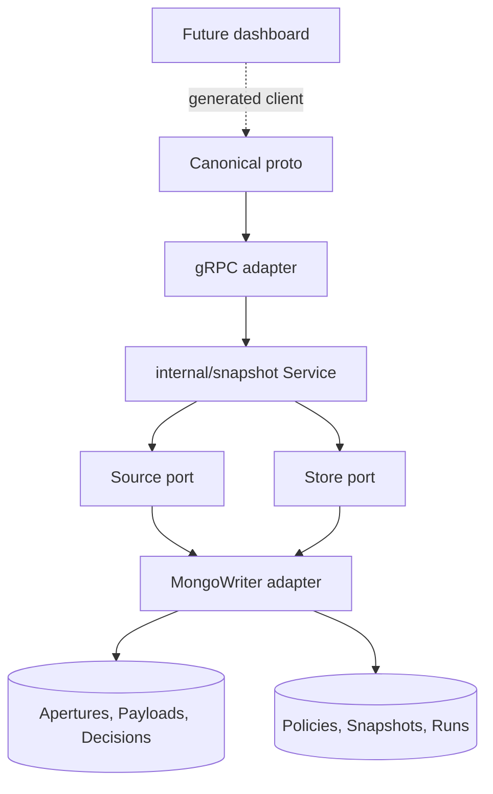
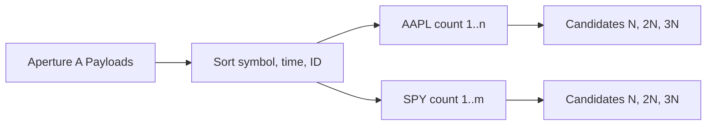
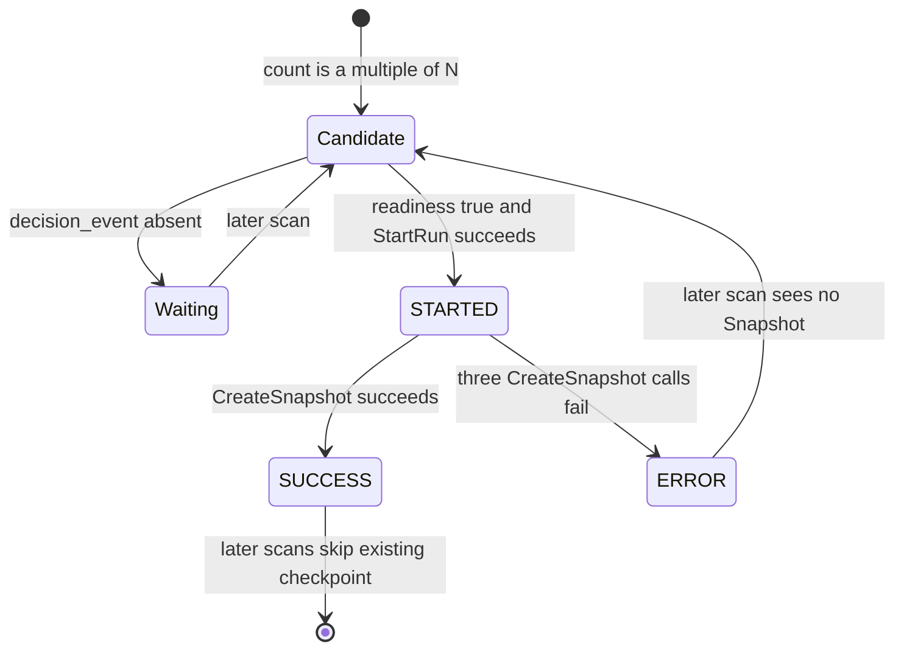

# QuanTRAM Snapshot Service V1

## 1. Document Control

| Item | Value |
|---|---|
| Specification type | Definitive service design |
| Date | September 4, 2026 |
| Status | Implemented and offline-validated; dashboard and live Mongo validation remain future |
| Public authority | `api/proto/quantram/v1/quantram.proto` |
| Semantic owner | `internal/snapshot` |
| V1 provider | MongoDB adapter on `persistence.MongoWriter` |

This specification classifies claims as **IMPLEMENTED**, **IMPLEMENTED / NOT LIVE-VALIDATED**, **DESIGN INTENT / NOT IMPLEMENTED**, **FUTURE**, or **GAP / HUMAN REVIEW REQUIRED**.

## 2. Purpose and Scope

Snapshot Service manages durable checkpoint policies, selects complete positions from one server-owned Aperture, records attempt history, and exposes policy/checkpoint/run reads through a typed gRPC contract. It does not save or restore scientific engine memory, duplicate D01/P-04 output, replay computation, or create a dashboard.

## 3. Snapshot Definition

A Snapshot is a reference to one durable Payload position:

```text
Snapshot = identity + Aperture + policy + Payload + symbol + ordinal + capture time
```

Detailed Bar, DecisionEvent, DMO, FMO, ReturnShape, Capturability, and PriceEvent remain in Payload/Decisions documents. “Snapshot” therefore means navigational checkpoint, not memory image or scientific-state serialization.

## 4. Architectural Boundaries



The core and proto contain no BSON, ObjectId, Mongo collection, cursor, query, or index type. IDs and page tokens are opaque strings. Provider conversion is an adapter concern.

## 5. Ownership Matrix

| Concern | Owner |
|---|---|
| Public messages/enums/RPCs | Proto |
| Validation, counting, candidate/readiness rules, retry count, run orchestration | Snapshot core |
| Ordered Payload references and Decision readiness | Source port/provider |
| Policy/checkpoint/run durability and pagination | Store port/provider |
| ObjectId, BSON, collections, filters, upserts, physical indexes | Mongo adapter |
| Current Aperture selection | Server composition |
| Scientific results and state | Existing adaptive/pricing/domain components |
| CURRENT/HISTORY/REV/FWD UI | Future dashboard, not implemented |

## 6. Database-Agnostic Models

| Model | Fields |
|---|---|
| `Trigger` | `Type`, `EveryNBars` |
| `Policy` | opaque ID, name, ACTIVE/INACTIVE, trigger, created/updated times |
| `Payload` | opaque ID/Aperture ID, symbol, interval start |
| `Snapshot` | opaque ID/Aperture/policy/Payload IDs, symbol, number, captured time |
| `Run` | opaque context IDs, symbol, count, start/completion, status, Snapshot ID, error |
| `Page` | size and opaque token |
| Filters/pages | optional typed filters plus items and next token |

## 7. Source and Store Contracts

Exact Source operations:

```go
ListPayloads(context.Context, string) ([]Payload, error)
DecisionComplete(context.Context, string, string) (bool, error)
```

Exact Store operations:

```text
Policies: ActivePolicies, GetPolicy, ListPolicies, CreatePolicy, UpdatePolicy
Snapshots: GetSnapshot, ListSnapshots, SnapshotExists, CreateSnapshot
Runs: StartRun, FinishRun, ListRuns
```

These are application ports, not public RPCs. `CreateSnapshot` is intentionally internal.

## 8. Policy Model

Valid statuses are ACTIVE and INACTIVE. The only valid trigger is `EVERY_N_BARS` with positive `every_n_bars`. Policy name is trimmed and required. Create ignores caller ID/times and assigns service time; update requires ID, preserves original `created_at`, and replaces mutable fields with a new `updated_at`.

N=10 is a test case and commented Compass example, not an automatically installed runtime policy. With no ACTIVE policy, no candidates are produced.

## 9. Per-Aperture and Per-Symbol Counting

Each Service instance is constructed with exactly one Aperture ID. Every evaluation loads all active policies and durable Payload references for that Aperture. It sorts by symbol, interval start, then opaque ID. For each policy, it starts a fresh count map keyed by symbol.



Counts are independent by symbol and policy evaluation. Irregular timestamps count as actual durable Bars; missing clock intervals are not synthesized. Counts rebuild from durable source state on each scan, so service restart resumes position without persisting a counter and without replaying science.

## 10. Candidate Algorithm

For each active valid policy and ordered Payload:

1. Ignore any Payload whose Aperture ID does not equal the Service Aperture.
2. Increment the symbol count.
3. Continue unless `count mod N == 0`.
4. Construct candidate with `snapshot_num = count / N` and current UTC `captured_at`.
5. Skip if the checkpoint already exists.
6. Ask Source whether matching `(aperture, payload)` Decisions has a `decision_event` field.
7. Wait silently when incomplete; reconsider on a later evaluation.
8. Start and execute one run when complete.

Readiness tests field existence only. It does not validate non-null content, adaptive outputs, PriceEvent, or scientific values.

## 11. Run and Checkpoint Lifecycle



Only Snapshot creation is retried, exactly up to three immediate calls with no core delay/backoff. Exhaustion finishes ERROR with code `SNAPSHOT_PERSISTENCE_ERROR`. Success finishes SUCCESS with Snapshot ID. StartRun and FinishRun failures are logged and not returned by `runCandidate`; a StartRun failure produces no Snapshot attempt in that scan.

An ERROR does not block later checkpoints or later recovery of the failed checkpoint.

## 12. Idempotency and Concurrency

Core checks `SnapshotExists`; Mongo also performs an idempotent `$setOnInsert` upsert keyed by `(aperture_id, policy_id, symbol, payload_id)`, backed by a unique index. Concurrent processes can create multiple STARTED attempts, but a partial unique run index permits only one SUCCESS for `(aperture_id, policy_id, symbol, trigger_payload_id)`. A duplicate SUCCESS finalization is converted to ERROR `CHECKPOINT_ALREADY_SUCCEEDED`.

## 13. Scheduling and Cancellation

`Run` evaluates immediately, then every configured interval; server composition uses one second. A non-positive constructor interval defaults to one second. `Evaluate` is serialized by a mutex, so scans do not overlap inside one Service. During coordinated close, main first stops external work and producers, drains accepted persistence facts, calls `FinalEvaluate`, then cancels and joins the background `Run` goroutine before Mongo close. `FinalEvaluate` delegates to the same exact-N, readiness-checked, idempotent algorithm; it does not create an end-of-Aperture trigger.

## 14. Public Proto Contract

The proto additions are additive and generated by Buf. Existing Bar, DecisionEvent, PriceEvent, health, semantic, and other service contracts remain unchanged.

### 14.1 Enums

| Enum | Values | Core/Mongo semantics |
|---|---|---|
| `SnapshotPolicyStatus` | UNSPECIFIED, ACTIVE, INACTIVE | UNSPECIFIED invalid for create/update; ACTIVE is evaluated |
| `SnapshotTriggerType` | UNSPECIFIED, EVERY_N_BARS | Only EVERY_N_BARS is valid |
| `SnapshotRunStatus` | UNSPECIFIED, STARTED, SUCCESS, ERROR | UNSPECIFIED means no list filter; other values are durable states |

### 14.2 Domain Messages

| Message | Contract |
|---|---|
| `SnapshotTrigger` | typed trigger plus positive `every_n_bars` |
| `SnapshotPolicy` | opaque ID, name/status/trigger, Unix-ms service timestamps |
| `Snapshot` | opaque references, symbol, one-based checkpoint ordinal, Unix-ms capture time |
| `SnapshotRunError` | stable code plus provider-detail message |
| `SnapshotRun` | attempt context/count/times/status and success-or-error result |

For an in-progress STARTED run, proto scalar `completed_at_unix_ms` and `snapshot_id` read as zero/empty and message `error` is absent. Mongo stores corresponding explicit null fields.

### 14.3 Requests and Responses

| Operation | Request fields | Response |
|---|---|---|
| Get policy | `id` | one typed policy |
| List policies | `page_size`, `page_token` | policy page/token |
| Create policy | `name`, `status`, `trigger` | canonical created policy |
| Update policy | `id`, `name`, `status`, `trigger` | canonical updated policy |
| Get Snapshot | `id` | one reference |
| List Snapshots | optional Aperture/policy/symbol plus page | reference page/token |
| List runs | optional Aperture/policy/symbol/status plus page | run page/token |

Default page size is 100; maximum is 1000. Mongo tokens currently encode the last returned ObjectId and query `_id > token` ascending, but clients must treat them as opaque.

### 14.4 RPC Surface

| RPC | Mutability | Status |
|---|---|---|
| `GetSnapshotPolicy` | Read | Implemented |
| `ListSnapshotPolicies` | Read | Implemented |
| `CreateSnapshotPolicy` | Write policy | Implemented |
| `UpdateSnapshotPolicy` | Replace policy | Implemented |
| `GetSnapshot` | Read | Implemented |
| `ListSnapshots` | Read | Implemented |
| `ListSnapshotRuns` | Read | Implemented |

There is no public CreateSnapshot RPC. Background evaluation is the only V1 checkpoint producer.

## 15. Error Contract

Core sentinel `ErrInvalid` maps to gRPC `InvalidArgument`; `ErrNotFound` maps to `NotFound`; unconfigured Snapshot service maps to `Unavailable`; all other service/provider errors map to `Internal`. Mongo `ErrNoDocuments` is converted to core not-found. Unsupported list run enum values are `InvalidArgument`.

## 16. Mongo V1 Mapping

| Core concept | Mongo representation |
|---|---|
| Opaque IDs | ObjectId hex strings at adapter boundary |
| Policy | `quantram_snapshot_policies` document |
| Snapshot | `quantram_snapshots` reference document |
| Run | `quantram_snapshot_runs` document with explicit nullable terminal fields |
| Payload source | Query `quantram_payloads` by Aperture, sorted by symbol/time/_id |
| Decision readiness | Existence query for `decision_event` in `quantram_decisions` |
| Page token | ObjectId hex internally |

## 17. Scientific Isolation

Snapshot code imports no adaptive or pricing package. It does not call D01, FMO, D02, D04, emitter, P-04, reset state, or alter warm-up. It reads durable references and readiness only. Failure at checkpoint 30 does not prevent checkpoint 40 and does not change scientific output.

The existing live in-memory WindowStore holds 64 Bars per symbol. That limit is separate from Snapshot counting, which uses durable Payloads for the current Aperture.

## 18. Dashboard Navigation Intent

```text
CURRENT -> choose HISTORY Aperture -> select Snapshot
                     REV <- S1 <- S2 -> S3 -> FWD
                                  |
                         expand referenced Payload/Decisions
                     return-to-CURRENT
```

**DESIGN INTENT / NOT IMPLEMENTED:** CURRENT/HISTORY mode, Aperture selection, REV/FWD, and return-to-CURRENT. Snapshot list/get APIs are partial backend foundation. Missing public Aperture enumeration and Payload/Decisions read APIs prevent a complete dashboard implementation. Current list ordering is ObjectId order, not an explicit navigation order by Snapshot number.

## 19. Implemented vs Future Matrix

| Capability | Core | Provider | Public API | Dashboard |
|---|---|---|---|---|
| Policy CRUD/validation | Implemented | Mongo implemented | Seven-RPC surface includes CRUD | Future |
| Per-Aperture/symbol candidate selection | Implemented | Durable source implemented | No manual trigger RPC | N/A |
| Decision readiness | Implemented | Field-existence query | Internal only | N/A |
| Snapshot idempotency | Implemented | Upsert + unique index | Read only | Future consumer |
| Run auditing | Implemented | Implemented | List implemented | Future consumer |
| Restart resume | Recounts durable Payloads | Implemented | N/A | N/A |
| CURRENT/HISTORY/REV/FWD | No UI semantics | Read foundation partial | Insufficient alone | Not implemented |
| Scientific state restore | Out of scope | Not stored | No API | Not implemented |

## 20. Invariants

- Service evaluates only its configured Aperture.
- Counts are actual durable Payload counts per symbol, per policy scan.
- A Snapshot references exactly one trigger Payload.
- A successful checkpoint is idempotent across repeated scans.
- No valid write persists unspecified policy/trigger status.
- Snapshot failure cannot enter or alter scientific execution.
- Provider details cannot leak into public/core contracts.

## 21. Known Gaps / Open Questions

1. No authorization policy is implemented for policy-mutating RPCs.
2. `DecisionComplete` tests field existence, not validity/non-null value.
3. StartRun/FinishRun failures are only logged; scans can leave STARTED records if finalization fails.
4. Snapshot creation retries have no delay/backoff or error classification.
5. ObjectId ordering is the current list order; navigation by `snapshot_num` is not a public guarantee.
6. No policy deletion, run recovery/timeout sweeper, retention, or migration exists.
7. No live Mongo, concurrent-process, signal-shutdown, or dashboard E2E test exists.

## 22. Validation Boundary

Core service, Mongo mapping/index definitions, and gRPC mappings/errors are offline-tested. Buf generation was validated before commit. The operator manually ran Compass setup, but no Go server-to-Mongo policy/candidate/Snapshot/run flow has been executed. No dashboard or live feed validation is claimed.

## 23. Change Log

| Date | Change |
|---|---|
| September 3, 2026 | Initial first-class Snapshot Service design. |
| September 4, 2026 | Rewritten with exact ports, candidate/run algorithms, proto mappings, pagination, provider boundaries, dashboard intent, and implementation gaps. |
| September 4, 2026 | Added coordinated final-evaluation contract after durable queue drain and before Snapshot join/Mongo close; no new trigger or proto surface. |
