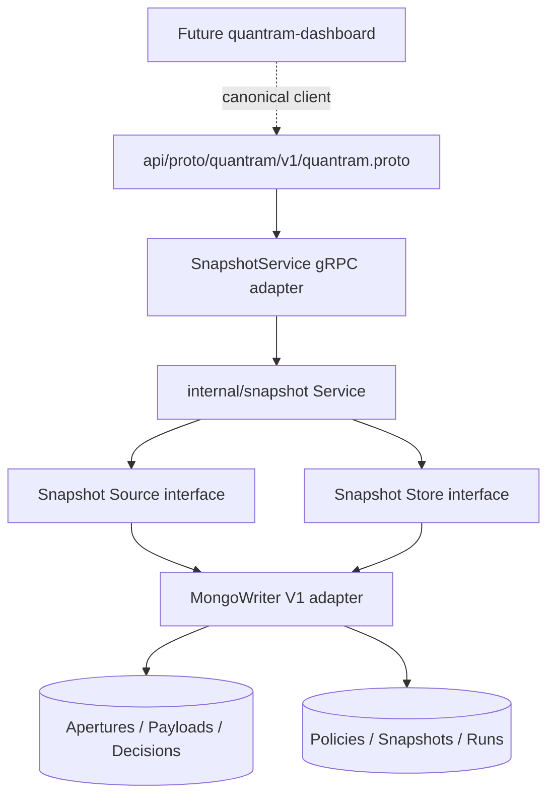
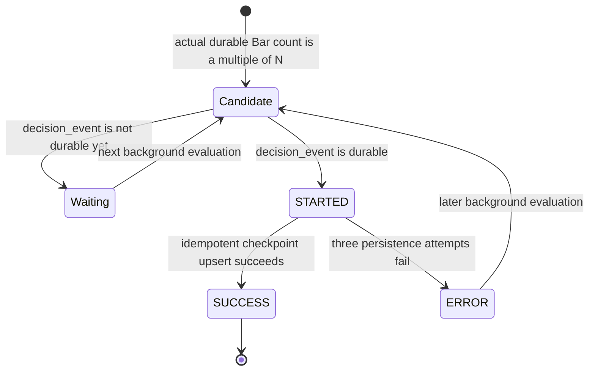

# QuanTRAM Snapshot Service V1

**Date:** September 3, 2026  
**Status:** IMPLEMENTED, OFFLINE VALIDATED

## Architecture

Snapshot is a first-class QuanTRAM application service. The parent proto is the public authority, `internal/snapshot` owns semantics, and MongoDB is only the V1 provider.

MongoDB ObjectIds, BSON, collection names, indexes, query filters, and upserts do not appear in the core package or public proto. Public and core IDs are opaque strings. The Mongo adapter converts them to and from ObjectId.

## Ownership

`SnapshotService` owns policy validation, EVERY_N_BARS semantics, candidate selection, completeness gating, retry limits, run lifecycle, background scheduling, and durable resume behavior.

`SnapshotSource` exposes ordered durable Payload references and terminal Decisions readiness. `SnapshotStore` exposes policy CRUD, checkpoint reads/idempotent creation, and run audit operations.

MongoDB owns physical documents, BSON mapping, ObjectId conversion, collection queries, pagination implementation, indexes, and `$setOnInsert` checkpoint upserts.

## Candidate and Completion Rules

The executable V1 trigger is `EVERY_N_BARS`; the initial development value is 10. Counting is per `(aperture_id, symbol)` over actual durable Payload Bars. Irregular timestamps count as individual Bars, while absent clock intervals produce no synthetic Bars.

Payloads are ordered by symbol, interval start, and opaque ID. The $N$th, $2N$th, and subsequent Payloads are candidates. A candidate is complete only when its matching durable Decisions record contains `decision_event`, the existing terminal host outcome. Optional scientific children are not required.

The service rebuilds counts from `SnapshotSource` each evaluation, so restart does not lose position and never replays D01 or P-04.

Mongo additionally enforces at most one SUCCESS run for `(aperture_id, policy_id, symbol, trigger_payload_id)` with a unique partial index. Concurrent losing attempts are finalized as ERROR rather than producing a second SUCCESS outcome.

Snapshot persistence alone is retried, at most three times per run. The idempotency key is `(aperture_id, policy_id, symbol, payload_id)`. A unique provider index and upsert prevent duplicate Snapshot records. Failed checkpoint 30 does not prevent checkpoint 40.

## Public Proto Contract

The authoritative file is `api/proto/quantram/v1/quantram.proto`. All additions are additive. Existing Bar, DecisionEvent, PriceEvent, health, semantic, and service fields are unchanged.

### Enums

| Enum | Value | Meaning / producer / consumer / mapping |
|---|---|---|
| `SnapshotPolicyStatus` | `UNSPECIFIED` | Invalid for writes; proto compatibility sentinel; not persisted by valid service calls. |
| `SnapshotPolicyStatus` | `ACTIVE` | Core service evaluates the policy; API clients configure/read it; Mongo stores `ACTIVE`. Current. |
| `SnapshotPolicyStatus` | `INACTIVE` | Core service does not evaluate the policy; clients configure/read it; Mongo stores `INACTIVE`. Current. |
| `SnapshotTriggerType` | `UNSPECIFIED` | Invalid for writes and reserved for proto compatibility. |
| `SnapshotTriggerType` | `EVERY_N_BARS` | Counts durable Payload Bars per Aperture and symbol; Mongo stores `EVERY_N_BARS`. Current and only executable trigger. |
| `SnapshotRunStatus` | `UNSPECIFIED` | No List filter / compatibility sentinel; not a persisted valid run state. |
| `SnapshotRunStatus` | `STARTED` | Core begins a real checkpoint attempt; dashboard may audit; Mongo stores `STARTED`. Current. |
| `SnapshotRunStatus` | `SUCCESS` | Snapshot persistence succeeded; dashboard may audit; Mongo stores `SUCCESS`. Current. |
| `SnapshotRunStatus` | `ERROR` | Bounded attempts failed; dashboard may audit; Mongo stores `ERROR`. Current. |

### Domain Messages

`SnapshotTrigger`: `type` selects the typed trigger; `every_n_bars` is the positive durable Bar interval. Both are produced by policy clients, consumed and validated by the core, and mapped to the policy document.

`SnapshotPolicy`: `id` is opaque provider identity; `name` is operator-facing identity; `status` controls evaluation; `trigger` defines executable policy; `created_at_unix_ms` and `updated_at_unix_ms` are service-controlled UTC times. The core produces/consumes the model; Mongo maps all fields. Current.

`Snapshot`: `id`, `aperture_id`, `policy_id`, and `payload_id` are opaque references; `symbol` defines count partition; `snapshot_num` is the one-based checkpoint ordinal; `captured_at_unix_ms` records publication time. The background service produces it, clients read it, and Mongo maps all fields. Current. It embeds no science.

`SnapshotRunError`: `code` is stable operational classification and `message` is provider failure detail. The core produces it after exhausted retries; clients read it; Mongo maps both fields. Current.

`SnapshotRun`: `id` identifies the audit record; `aperture_id`, `policy_id`, `symbol`, and `trigger_payload_id` identify the attempted checkpoint; `trigger_count` is the actual durable Bar count; `started_at_unix_ms` and `completed_at_unix_ms` bound the attempt; `status` is STARTED/SUCCESS/ERROR; `snapshot_id` is populated on success; `error` is populated on failure. Core produces, clients read, Mongo maps. Current.

### Request and Response Messages

| Message | Fields | Role |
|---|---|---|
| `GetSnapshotPolicyRequest` | `id` | Opaque policy lookup input. Current. |
| `GetSnapshotPolicyResponse` | `policy` | Typed policy result. Current. |
| `ListSnapshotPoliciesRequest` | `page_size`, `page_token` | Bounded provider-neutral pagination. Current. |
| `ListSnapshotPoliciesResponse` | `policies`, `next_page_token` | Typed policy page. Current. |
| `CreateSnapshotPolicyRequest` | `name`, `status`, `trigger` | Client-supplied mutable policy fields; service owns ID/times. Current. |
| `CreateSnapshotPolicyResponse` | `policy` | Created canonical policy. Current. |
| `UpdateSnapshotPolicyRequest` | `id`, `name`, `status`, `trigger` | Full mutable replacement identified by opaque ID. Current. |
| `UpdateSnapshotPolicyResponse` | `policy` | Updated canonical policy. Current. |
| `GetSnapshotRequest` | `id` | Opaque checkpoint lookup. Current. |
| `GetSnapshotResponse` | `snapshot` | Typed checkpoint reference. Current. |
| `ListSnapshotsRequest` | `aperture_id`, `policy_id`, `symbol`, `page_size`, `page_token` | Optional typed filters and pagination. Current; intended for future dashboard navigation. |
| `ListSnapshotsResponse` | `snapshots`, `next_page_token` | Typed checkpoint page. Current. |
| `ListSnapshotRunsRequest` | `aperture_id`, `policy_id`, `symbol`, `status`, `page_size`, `page_token` | Optional audit filters and pagination. Current. |
| `ListSnapshotRunsResponse` | `runs`, `next_page_token` | Typed audit page. Current. |

All page tokens are opaque to clients. Mongo V1 currently uses ObjectId-backed continuation internally, but that representation is not a public guarantee.

### RPCs

| RPC | Meaning | Producer / consumer | Persistence |
|---|---|---|---|
| `GetSnapshotPolicy` | Read one policy. | Service / future dashboard. | Mongo policy lookup. Current. |
| `ListSnapshotPolicies` | Read a policy page. | Service / future dashboard. | Mongo policy query. Current. |
| `CreateSnapshotPolicy` | Create a validated policy. | Authorized client / service. | Mongo policy insert. Current. |
| `UpdateSnapshotPolicy` | Replace mutable policy configuration. | Authorized client / service. | Mongo policy replacement. Current. |
| `GetSnapshot` | Read one checkpoint. | Service / future dashboard. | Mongo Snapshot lookup. Current. |
| `ListSnapshots` | Read filtered checkpoints. | Service / future dashboard. | Mongo Snapshot query. Current. |
| `ListSnapshotRuns` | Read filtered operational attempts. | Service / future dashboard. | Mongo run query. Current. |

There is no public CreateSnapshot RPC. Background policy evaluation is the only V1 checkpoint producer.

## Mongo V1

Mongo uses `quantram_snapshot_policies`, `quantram_snapshots`, and `quantram_snapshot_runs` in addition to the authoritative `quantram_apertures`, `quantram_payloads`, and `quantram_decisions` ledger.

Payload remains `{_id, aperture_id, bar}` with the complete nested canonical `internal/domain.Bar`. Aperture lifecycle fields are `open` and `shut`.

The Compass script configures validators and indexes only. Its N=10 policy insert remains commented and manual.

## Isolation

Snapshot runs beside the scientific pipeline under application cancellation. It is not inserted into Bar, D01, FMO, D02, D04, emitter, or P-04 processing. Snapshot delay or failure cannot block ingestion, replay science, reset warm-up, mutate symbol state, or alter existing approximately-100-Bar behavior.

The dashboard remains unchanged. It is a future consumer of the generated canonical service contract after a separately authorized synchronization task.
