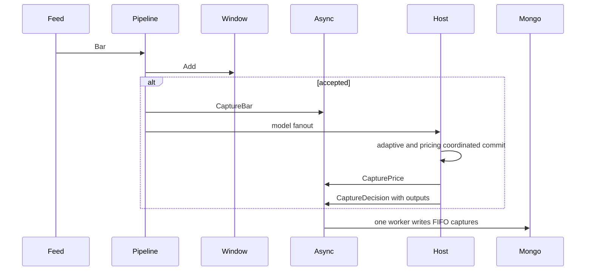
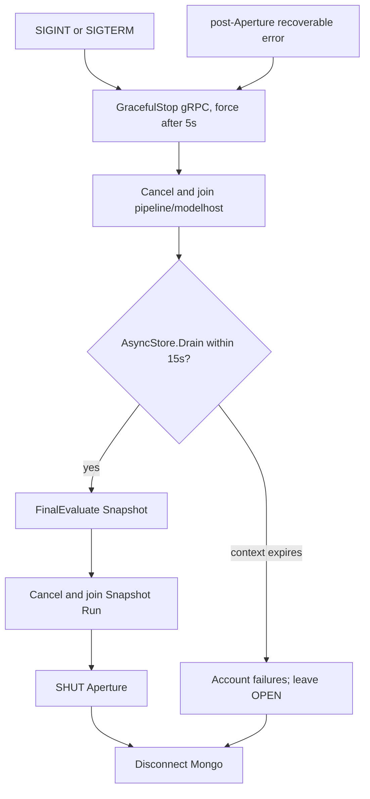

# QuanTRAM MongoDB Aperture Persistence V1 Implementation

## 1. Implementation Status

| Item | Value |
|---|---|
| Date | September 4, 2026 |
| Branch | `mongodb-persistene-v1` |
| Commit | `cb3dfafa89d0af7bdb7189301b3a73a26a007b36` |
| Baseline parent | `1e2becd38393153a38837f53c7297ba5e211986a` |
| Validation | Offline deterministic tests, generation, and vet passed before commit |
| Live runtime status | Not live-validated against MongoDB |

The implementation delivers the six-collection persistence and Snapshot substrate. Assertions below are classified as **IMPLEMENTED**, **IMPLEMENTED / NOT LIVE-VALIDATED**, or **GAP / HUMAN REVIEW REQUIRED**.

## 2. Delivered Components

| Component | Responsibility | Status |
|---|---|---|
| `internal/persistence/model.go` | BSON envelopes and collection constants | Implemented |
| `internal/persistence/mongo.go` | Connect/ping, indexes, Aperture lifecycle, ledger writes | Implemented / not live-validated |
| `internal/persistence/async.go` | Bounded nonblocking capture worker and health | Implemented and unit-tested |
| `internal/persistence/snapshot_adapter.go` | Snapshot Source/Store Mongo provider | Implemented and offline-tested |
| `internal/config/config.go` | Mongo URI/database/queue configuration | Implemented and unit-tested |
| `cmd/quantram-server/main.go` | Optional composition and coordinated signal/error close path | Implemented and offline-tested |
| `internal/ingestion/pipeline.go` | Accepted-Bar capture hook | Implemented and tested |
| `internal/modelhost/host.go` | committed Price/Decision capture hooks | Implemented and tested |
| Domain/adaptive files | Explicit canonical BSON field mappings | Implemented and BSON-tested |
| Compass JS | Six validators and all indexes | Manually executed by operator; not executed in this audit |

The official dependency is `go.mongodb.org/mongo-driver/v2 v2.8.2`.

## 3. Server Composition Trace

```text
main
  config.Load
  net.Listen
  newPersistence
    URI empty -> nil store, nil SnapshotService
    OpenMongo (10-second startup context)
      Connect -> Ping -> database -> indexes -> insert new OPEN Aperture
    snapshot.NewService(writer, writer, writer.ApertureID(), 1 second)
    persistence.NewAsyncStore(writer, configured queue)
  newPipeline(capture=store)
  modelhost.New(Capture=store)
  register SnapshotService whether configured or nil-backed
  signal.NotifyContext(SIGINT, SIGTERM)
  start Snapshot, pipeline, host, and gRPC goroutines with WaitGroups
  shutdownRuntime: stop gRPC; join producers; drain; final Snapshot; join Snapshot; close writer
```

`requireSnapshotService` returns gRPC `Unavailable` when Mongo is disabled.

## 4. Aperture Creation Algorithm

`OpenMongo` rejects an empty URI when called directly, defaults an empty database, connects, pings, and ensures ledger plus Snapshot indexes. It then calls `createProcessAperture` once with one UTC timestamp.

For up to five attempts:

1. `LatestSequence` queries all Apertures sorted by `sequence_num: -1`.
2. Empty collection maps to zero.
3. Construct `sequence_num = latest + 1`, `open = at`, `created_at = at`, `shut = null`, `status = OPEN`, plus semantic/model/schema versions.
4. Insert without `_id`; require a nonzero driver-generated ObjectId.
5. Return on success; retry only a Mongo duplicate-key error.

No OPEN-record lookup, repair, reuse, or shutdown occurs.

## 5. Aperture Close Algorithm

`AsyncStore.Drain` seals capture submission, closes the queue once, and waits for its worker under the caller's bounded context. `shutdownRuntime` invokes it only after gRPC work is stopped and pipeline/modelhost have joined. If drain succeeds, final Snapshot evaluation runs while Mongo remains connected, SnapshotService joins, and `AsyncStore.Close` calls `MongoWriter.Close`. The writer attempts:

1. `UpdateOne({_id: current, status: OPEN}, {$set: {status: SHUT, shut: utcNow}})`.
2. Disconnect regardless of the SHUT update result.
3. Return `errors.Join(shutErr, disconnectErr)`.

Identity, sequence, open time, created time, and version metadata are unchanged. Close paths are idempotent. If drain times out, the worker is canceled and joined, remaining captures are failure-accounted, final Snapshot and SHUT are skipped, and `MongoWriter.Disconnect` is still attempted. This preserves OPEN as evidence rather than falsely claiming complete durability.

## 6. Capture Integration Trace



Bar capture occurs before subscriber and model fanout. On a jointly successful host commit, Price capture precedes Decision capture. Each event capture precedes its subscriber broadcast. Gate and timeout Decision skips have nil adaptive outputs.

## 7. Ledger Write Algorithms

### 7.1 Payload

Reject missing `market_snapshot_id`. Generate a candidate ObjectId and `UpdateOne` with upsert, filtering `(current aperture_id, bar.market_snapshot_id)` and using `$setOnInsert` for the entire nested Payload. Repeated identity is a no-op.

### 7.2 Decision

Resolve Payload `_id` by current Aperture plus `market_snapshot_id`. Upsert Decisions by `payload_id`: `$setOnInsert` supplies `_id`, `aperture_id`, and `payload_id`; `$set` writes `decision_event` and, only when non-nil, `adaptive_outputs`.

### 7.3 Price

Resolve the same Payload and use the same convergent upsert, setting `price_event`. A globally unique `payload_id` index ensures one Decisions envelope.

No transaction spans these operations. A Decision/Price capture that runs before its Payload is durable fails resolution and follows worker retries.

## 8. Canonical BSON Mapping

| Envelope | Required core fields | Optional/convergent children |
|---|---|---|
| Aperture | `_id`, `sequence_num`, `open`, `shut`, `status`, three version fields, `created_at` | `shut` value nullable while OPEN |
| Payload | `_id`, `aperture_id`, complete nested `bar` | None in Go model |
| Decisions | `_id`, `aperture_id`, `payload_id` | `decision_event`, `adaptive_outputs`, `price_event` |
| Policy | `_id`, `name`, `status`, trigger, times | None in Go model |
| Snapshot | `_id`, Aperture/policy/Payload refs, symbol, number, time | None |
| SnapshotRun | identity/context/count/start/status plus completed/snapshot/error fields | Pointer values are explicit BSON null while STARTED |

`adaptive.PipelineOutputs` is implemented with BSON children `dmo`, `fmo`, `return_shape`, and `capturability`. `ReturnShape` and `CapturabilityResult` are concrete package types, not missing placeholders.

## 9. Index Creation

Startup creates ten application indexes across six collections: one Aperture index, two Payload indexes, two Decisions indexes, one policy index, two Snapshot indexes, and three SnapshotRun indexes. The exact key definitions and uniqueness rules are normative in the companion design specification and `snapshotIndexModels`/`ensureIndexes`.

Index creation precedes Aperture insertion. Any creation error disconnects and aborts persistence/server startup.

## 10. AsyncStore Semantics

| Behavior | Implementation |
|---|---|
| Capacity | Positive configured integer; constructor fallback 1024 |
| Producer wait | Nonblocking queue send under closed-state mutex |
| Drop conditions | Missing correlation ID, full queue, closed queue |
| Worker count | One |
| Per-item attempts | Three |
| Attempt timeout | Five seconds |
| Retry sleeps | 25 ms, then 50 ms; no exponential backoff |
| Exhausted failure | Increment failure, set last error, log, continue |
| Health | QueueDepth, Dropped, Written, Failures, LastError |
| Drain | Stop acceptance, close/drain queue; 15-second server close budget |
| Drain timeout | Cancel/join worker, failure-account remaining work, leave OPEN, disconnect |
| Close | Idempotent SHUT then idempotent disconnect after successful drain/final Snapshot |

Captured adaptive slices/maps are already exposed through a defensive copy from `LastPipelineOutputs` before enqueue.

## 11. Configuration and Script Behavior

| Variable | Parse and default | Effect |
|---|---|---|
| `QUANTRAM_MONGODB_URI` | Trim raw environment; default empty | Empty disables all persistence/Snapshot composition. A literal `disabled` would be passed as a URI and is not the disable mechanism. |
| `QUANTRAM_MONGODB_DATABASE` | Existing default helper; `quantram_db` | Selects database. |
| `QUANTRAM_MONGODB_QUEUE` | `Atoi`; default 1024; must be >0 | Config validation occurs even when URI is empty. |

`Start-QuantramIngestion.ps1` does not define Mongo parameters or mutate these variables. It inherits the caller environment. Non-smoke execution runs the server in the current console, where Ctrl+C can reach the signal-aware process path. Smoke mode launches with `Start-Process` and force-stops server processes in `finally`; that is not an orderly SHUT guarantee.

## 12. Shutdown Path Analysis



  `run` returns errors rather than calling `log.Fatalf` after Aperture creation. `main` logs the returned error and exits only after `run` has completed coordinated or fallback persistence closure.

## 13. Test Traceability Matrix

| Requirement | Test evidence | What it proves | Boundary |
|---|---|---|---|
| Canonical nesting | `TestPayloadAndDecisionBSONPreserveCanonicalNesting` | Bar nesting and adaptive child names | BSON only |
| OPEN/shut vocabulary | `TestApertureBSONUsesOpenShutVocabulary` | Serialized names/null semantics | No database |
| New run identity | `TestCreateProcessApertureOwnsNewLifecycle` | sequence, retry/new OPEN behavior | Fake repository |
| Writer lineage | `TestGeneratedApertureIsWriterLineageContext` | retained Aperture ID | No database |
| SHUT then disconnect | `TestMongoWriterCloseShutsCurrentApertureThenDisconnects` | direct close call order/state | Fake repository/client |
| Bounded async capture | `TestAsyncStoreIsBoundedNonblockingAndFlushesInOrder` | drop/FIFO/drain | Fake writer |
| Drain timeout policy | `TestAsyncStoreDrainTimeoutAccountsWorkAndDisconnectsWithoutShut` | canceled worker, failure accounting, no SHUT, disconnect, idempotency | Fake writer |
| Coordinated close order | `TestShutdownRuntimeCoordinatesProducersSnapshotAndPersistence` | producer/gRPC stop, drain, final Snapshot, Snapshot join, close | Lifecycle fakes |
| Snapshot ID/BSON/index adapter | four `snapshot_adapter_test.go` tests | conversion, mapping, definitions | No Mongo server |
| Pipeline capture | pipeline recorder tests | accepted Bar hook behavior | In-memory |
| Host capture | host recorder tests | Price-before-Decision and outputs | In-memory |
| URI absent | server main tests | nil persistence/service composition | No Mongo |

There is no process test that sends Ctrl+C and verifies a live Aperture transition.

## 14. Compass vs Go Alignment

| Area | Result |
|---|---|
| Six collection names | Aligned |
| ObjectId references | Aligned |
| Nested Bar | Aligned |
| OPEN `shut: null` | Aligned |
| Optional Decisions children | Aligned |
| Snapshot trigger `every_n_bars` | Aligned |
| SnapshotRun required nullable terminal fields | Aligned: Go emits explicit null due to non-`omitempty` pointer fields |
| Index keys/unique/partial constraints | Aligned by static comparison |
| Runtime validator acceptance | Not live-tested |

The operator manually executed the Compass setup. This does not establish that Go writes have passed validators.

## 15. Known Gaps and Risks

1. **GAP:** no live Mongo validator/index/write/Aperture signal test.
2. A drain timeout intentionally leaves OPEN; failure counters are not durable after disconnect.
3. Payload and Decisions writes are not transactional; ordering is queue-dependent with retries.
4. Metrics are in-process health counters only and are not persisted or exposed as a dedicated Mongo health collection.
5. The pre-existing adaptive hash reproducibility risk from floating-point accumulation over map iteration was observed but is outside this implementation.

## 16. Operations and Validation

After coordinated-lifecycle implementation, `go test ./...` passed 115 tests, `go vet ./...` passed, and `git diff --check` passed. Focused `go test -race` was attempted for server, persistence, and Snapshot packages but this Windows environment reports that race testing requires CGO; the environment was not changed. No server, script, client, Mongo connection, Compass operation, Alpaca/IEX request, WebSocket, or live market operation was run.

## 17. Change Log

| Date | Change |
|---|---|
| September 3, 2026 | Initial implementation record. |
| September 4, 2026 | Rewritten from current code with algorithms, file ownership, exact retry/config behavior, test traceability, Compass alignment, and shutdown gaps. |
| September 4, 2026 | Added coordinated lifecycle implementation: explicit run error propagation, joins, split drain/finalize, final Snapshot scan, timeout accounting, and idempotent close. |
